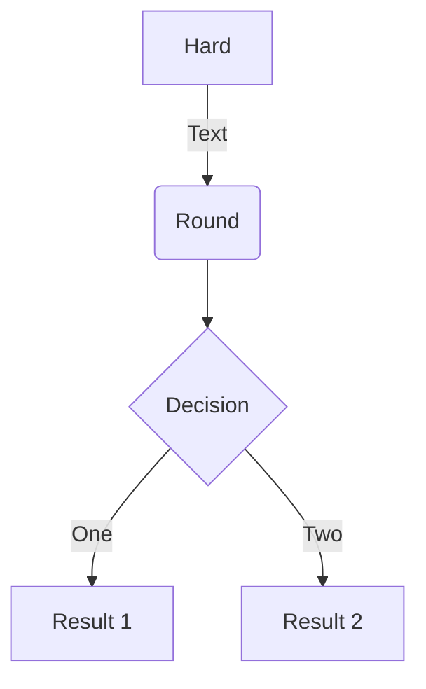

## Image caption


```md
{ width="300" }
/// caption
Image caption
///
```


{ width="300" }
/// caption
Image caption
///


## Table caption

```
Fruit      | Amount
---------- | ------
Apple      | 20
Peach      | 10
Banana     | 3
Watermelon | 1

/// caption
Fruit Count
///
```

Fruit      | Amount
---------- | ------
Apple      | 20
Peach      | 10
Banana     | 3
Watermelon | 1

/// caption
Fruit Count
///


## Cambio de posición de caption

{ width="300" }

/// caption | <
Caption 1
///

{ width="300" }

/// caption
Caption 2
///

## Con numveración automática



/// figure-caption
Decision Diagram
///

Fruit      | Amount
---------- | ------
Apple      | 20
Peach      | 10
Banana     | 3
Watermelon | 1

/// table-caption
Fruit Count
///


/// figure-caption
Decision Diagram
///

Fruit      | Amount
---------- | ------
Apple      | 20
Peach      | 10
Banana     | 3
Watermelon | 1

/// table-caption
Fruit Count
///