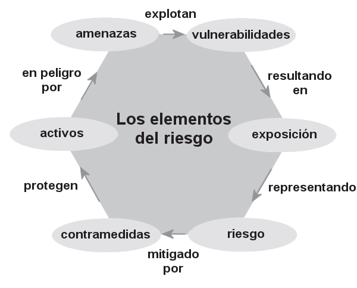

# ⁠2. Conceptos Fundamentales

## ⁠2.1. Activo, Vulnerabilidad, Amenaza, Riesgo y Controles

En la gestión de la seguridad de la información, es fundamental comprender varios conceptos clave que forman la base para identificar y mitigar los riesgos a los que están expuestos los recursos de una organización. Estos conceptos incluyen **activo**, **vulnerabilidad**, **amenaza**, **riesgo** y **controles**. A continuación, se explican estos términos y su interrelación.

### ⁠2.1.1. Activo

Un **activo** es cualquier recurso de valor para la organización que necesita ser protegido. Los activos pueden ser tangibles o intangibles y abarcan desde la información misma hasta los sistemas que la procesan, almacenan y transmiten. Ejemplos de activos incluyen:

- **Datos y bases de datos**: Información crítica, como registros de clientes, propiedad intelectual, planes estratégicos, etc.
- **Sistemas de información**: Hardware, software, redes y servidores.
- **Recursos humanos**: Personal con conocimientos especializados.
- **Infraestructura física**: Edificios, centros de datos, instalaciones de telecomunicaciones.

El valor de un activo depende de su importancia para la operación y el éxito de la organización, así como del impacto que tendría su pérdida, daño o compromiso.

> **Activo**: Componente o funcionalidad de un sistema de información susceptible de ser atacado deliberada o accidentalmente con consecuencias para la organización. Incluye: información,  datos, servicios, aplicaciones (software), equipos (hardware), comunicaciones, recursos administrativos, recursos físicos y recursos humanos. [UNE 71504:2008]

### ⁠2.1.2. Vulnerabilidad

Una **vulnerabilidad** es una debilidad o deficiencia en un activo o en las medidas de seguridad que lo protegen, que podría ser explotada por una amenaza para causar daño. Las vulnerabilidades pueden ser de naturaleza técnica, física, o humana. Ejemplos de vulnerabilidades incluyen:

- **Fallos de software**: Bugs o configuraciones inseguras que pueden ser explotadas por un atacante.
- **Controles de acceso inadecuados**: Contraseñas débiles o mal gestionadas.
- **Deficiencias físicas**: Áreas no aseguradas o dispositivos sin protección física adecuada.
- **Errores humanos**: Falta de formación del personal o errores operacionales.

La existencia de una vulnerabilidad no implica necesariamente que se vaya a sufrir un daño, pero sí aumenta el potencial de que una amenaza se materialice.

### ⁠2.1.3. Amenaza

Una **amenaza** es cualquier circunstancia o evento con el potencial de explotar una vulnerabilidad y causar daño a un activo. Las amenazas pueden ser intencionales, como los ataques cibernéticos, o no intencionales, como los desastres naturales. Ejemplos de amenazas incluyen:

- **Ciberataques**: Malware, phishing, ataques DDoS, etc.
- **Desastres naturales**: Inundaciones, terremotos, incendios.
- **Fallos técnicos**: Caídas de sistemas, fallos de hardware.
- **Errores humanos**: Borrado accidental de datos, divulgación no autorizada de información.

El impacto de una amenaza puede variar, dependiendo de la vulnerabilidad que explote y del valor del activo afectado.

### ⁠2.1.4. Riesgo

El **riesgo** es la posibilidad de que una amenaza explote una vulnerabilidad y cause un impacto negativo sobre un activo. En términos simples, el riesgo puede ser entendido como la probabilidad de que ocurra un evento adverso y la magnitud de sus consecuencias. El riesgo se calcula generalmente como:

	Riesgo = Probabilidad de la amenaza × Impacto del evento

Los riesgos pueden ser categorizados en función de su gravedad y la urgencia de mitigación, lo que ayuda a las organizaciones a priorizar sus esfuerzos de seguridad.

### ⁠2.1.5. Controles

Los **controles** son las medidas y procedimientos implementados para mitigar o eliminar los riesgos, reduciendo la probabilidad de que una amenaza explote una vulnerabilidad o minimizando el impacto si ocurre un incidente de seguridad. Los controles pueden ser de varios tipos, incluidos:

- **Controles preventivos**: Destinados a evitar que ocurran incidentes de seguridad (por ejemplo, firewalls, políticas de acceso, autenticación multifactor).
- **Controles detectivos**: Diseñados para identificar incidentes de seguridad cuando ocurren (por ejemplo, sistemas de detección de intrusiones, registros de auditoría).
- **Controles correctivos**: Orientados a mitigar el daño y recuperar la funcionalidad tras un incidente (por ejemplo, planes de recuperación ante desastres, copias de seguridad).

Los controles deben ser seleccionados y diseñados en función del análisis de riesgos y alineados con los objetivos de la organización, garantizando que sean adecuados para proteger los activos de forma eficaz y eficiente.

Es posible que los controles no siempre consigan el efecto pretendido.

Los controles también son denominados **salvaguardas**, **medidas** de seguridad o contramedidas.

### ⁠2.1.6. Interrelación de los Conceptos

La relación entre estos conceptos es fundamental para la gestión de la seguridad de la información. Un activo valioso que presenta una vulnerabilidad puede estar en riesgo si existe una amenaza que pueda explotarlo. Los controles se implementan para reducir estos riesgos, protegiendo así los activos de la organización. La evaluación continua de los riesgos y la actualización de los controles es esencial para mantener la seguridad en un entorno cambiante.

{width=80%}
/// caption
Los elementos del riesgo
///

## ⁠2.2. Diferencia entre vulnerabilidades,  Amenazas y Exploits

Las amenazas en la seguridad de la información son diversas y en constante evolución, pero la adopción de medidas básicas y efectivas puede reducir significativamente los riesgos. La combinación de tecnología, procesos de seguridad y la concienciación del personal es clave para proteger a la organización contra las amenazas más comunes.

En ciberseguridad, los conceptos de **vulnerabilidad**, **amenaza** y **exploit** están profundamente interrelacionados y son clave para entender los riesgos a los que se enfrenta un sistema. Vamos a definirlos y mostrar cómo se conectan entre sí:

### ⁠2.2.1. **Vulnerabilidad**

Una vulnerabilidad es una **debilidad** o fallo en un sistema, software o proceso que puede ser explotado por un atacante. Esta debilidad puede estar en el diseño del software, en la configuración incorrecta de un sistema o incluso en un comportamiento humano (como el uso de contraseñas débiles). Las vulnerabilidades no causan daño por sí mismas, pero actúan como una **puerta de entrada** para posibles ataques.

- **Ejemplo**: Un fallo de seguridad en un sistema operativo que permite que usuarios no autorizados obtengan acceso a datos sensibles.

### ⁠2.2.2. **Amenaza**

Una amenaza es cualquier entidad o circunstancia que tenga el **potencial** de aprovecharse de una vulnerabilidad para causar daño. Las amenazas pueden ser personas (hackers), eventos (un apagón eléctrico) o incluso fallos internos del sistema.

- **Ejemplo**: Un cibercriminal que intenta acceder a un sistema para robar información o un ataque de malware diseñado para explotar un fallo en el sistema.

### ⁠2.2.3. **Exploit**

Un exploit es una **herramienta** o técnica específica que un atacante utiliza para aprovecharse de una vulnerabilidad. Es el método mediante el cual una amenaza se convierte en un ataque real. Los exploits pueden ser programas, scripts o secuencias de comandos que están diseñados para tomar ventaja de una debilidad en un sistema.

- **Ejemplo**: Un código de ataque que se ejecuta en un servidor vulnerable para obtener privilegios de administrador.

### ⁠2.2.4. Relación entre los conceptos:

- Una **vulnerabilidad** es una debilidad que puede ser aprovechada.
- Una **amenaza** es cualquier cosa que tiene la intención de explotar esa vulnerabilidad.
- Un **exploit** es el mecanismo o herramienta utilizada para explotar la vulnerabilidad.

**Ejemplo práctico**: Imagina que en una aplicación web hay una vulnerabilidad en la validación de entradas de usuario (por ejemplo, no se sanitizan correctamente los datos ingresados). Un hacker (amenaza) podría escribir un script (exploit) que aproveche esta vulnerabilidad para inyectar código malicioso en la base de datos (ataque de inyección SQL).

Estos conceptos son clave en la gestión de la seguridad informática, ya que identificar las vulnerabilidades y estar consciente de las amenazas potenciales es crucial para proteger los sistemas y prevenir que se utilicen exploits en su contra.

## ⁠2.3. Amenazas Comunes y Medidas Básicas de Protección

En el panorama actual de la seguridad de la información, las organizaciones se enfrentan a una amplia gama de amenazas que pueden comprometer la confidencialidad, integridad y disponibilidad de sus activos digitales. A continuación, se describen algunas de las amenazas más comunes y las medidas básicas que se pueden adoptar para mitigarlas.

### ⁠2.3.1. **Malware**

El **malware** (software malicioso) es un término general que abarca virus, gusanos, troyanos, ransomware, spyware, y otros tipos de software diseñado para dañar, interrumpir o robar información de sistemas informáticos. Una de las formas más peligrosas de malware es el **ransomware**, que cifra los archivos de la víctima y exige un rescate para restaurar el acceso.

**Medidas básicas de protección:**

- **Uso de software antivirus y antimalware**: Instalar y mantener actualizado un software de seguridad que escanee y elimine malware de los sistemas.
- **Actualización regular de software**: Aplicar parches y actualizaciones de seguridad para corregir vulnerabilidades en el sistema operativo y aplicaciones.
- **Educación del usuario**: Capacitar a los empleados para que reconozcan correos electrónicos sospechosos y eviten hacer clic en enlaces o descargar archivos de fuentes no confiables.

### ⁠2.3.2. **Phishing**

El **phishing** es una técnica de ingeniería social en la que los atacantes se hacen pasar por entidades confiables para engañar a las víctimas y hacer que revelen información confidencial, como contraseñas, números de tarjetas de crédito o datos personales. Esta amenaza es comúnmente ejecutada a través de correos electrónicos fraudulentos.

**Medidas básicas de protección:**

- **Autenticación multifactor (MFA)**: Implementar MFA para proteger las cuentas, de modo que incluso si las credenciales se ven comprometidas, el acceso no autorizado es más difícil.
- **Filtros de correo electrónico**: Configurar filtros de spam y phishing en los sistemas de correo electrónico para reducir la cantidad de correos electrónicos fraudulentos que llegan a los usuarios.
- **Concienciación y formación**: Capacitar a los empleados para identificar correos electrónicos de phishing y enseñarles a verificar la autenticidad de las solicitudes antes de proporcionar cualquier información.

### ⁠2.3.3. **Ataques de Denegación de Servicio (DoS) y DDoS**

Los ataques de **Denegación de Servicio (DoS)** y **Denegación de Servicio Distribuida (DDoS)** tienen como objetivo sobrecargar un sistema, red o servicio con una cantidad abrumadora de tráfico, haciéndolo inaccesible para los usuarios legítimos. Los ataques DDoS, en particular, utilizan múltiples sistemas comprometidos para amplificar el impacto.

**Medidas básicas de protección:**

- **Implementación de firewalls y sistemas de detección de intrusiones**: Utilizar cortafuegos avanzados y sistemas de detección/prevención de intrusiones para filtrar el tráfico malicioso y mitigar los ataques antes de que afecten a la red.
- **Servicios de mitigación DDoS**: Contratar servicios especializados que monitorean y mitigan ataques DDoS en tiempo real.
- **Redundancia y distribución de servicios**: Diseñar la infraestructura para que sea escalable y distribuida, reduciendo la vulnerabilidad a un ataque DoS.

### ⁠2.3.4. **Ataques de Fuerza Bruta**

Los ataques de **fuerza bruta** intentan acceder a una cuenta o sistema adivinando las contraseñas mediante la prueba sistemática de combinaciones posibles. Estos ataques pueden ser efectivos si se utilizan contraseñas débiles o si no se han implementado medidas de seguridad adecuadas.

**Medidas básicas de protección:**

- **Contraseñas seguras**: Implementar políticas de contraseñas que requieran combinaciones complejas y actualizar las contraseñas regularmente.
- **Limitación de intentos de inicio de sesión**: Configurar los sistemas para bloquear o retrasar temporalmente las cuentas después de varios intentos fallidos de inicio de sesión.
- **Autenticación multifactor (MFA)**: Utilizar MFA para agregar una capa adicional de seguridad más allá de las contraseñas.

### ⁠2.3.5. **Exfiltración de Datos**

La **exfiltración de datos** ocurre cuando un atacante logra acceder y extraer información confidencial de un sistema sin autorización. Esto puede ocurrir mediante el uso de malware, phishing, o explotación de vulnerabilidades en la red.

**Medidas básicas de protección:**

- **Cifrado de datos**: Asegurar que los datos sensibles estén cifrados tanto en tránsito como en reposo, para que incluso si son robados, no puedan ser leídos sin la clave de cifrado.
- **Monitorización continua**: Implementar herramientas de monitorización de la red para detectar actividades anómalas que puedan indicar exfiltración de datos.
- **Políticas de acceso mínimo**: Adoptar un enfoque de “mínimo privilegio”, asegurando que los usuarios solo tengan acceso a la información necesaria para realizar sus tareas.

### ⁠2.3.6. **Ingeniería Social**

La **ingeniería social** se basa en la manipulación psicológica para engañar a las personas y hacer que revelen información confidencial o realicen acciones que comprometan la seguridad. Aparte del phishing, otras tácticas incluyen el **pretexting** (creación de una historia falsa para obtener información) y **tailgating** (seguimiento no autorizado a alguien para acceder a una ubicación restringida).

**Medidas básicas de protección:**

- **Concienciación y capacitación**: Educar a los empleados sobre las tácticas de ingeniería social y cómo evitar ser manipulados.
- **Políticas claras de seguridad**: Establecer y comunicar políticas claras sobre la divulgación de información y la verificación de solicitudes sospechosas.
- **Verificación de identidad**: Asegurarse de que todas las solicitudes de información confidencial sean verificadas a través de canales oficiales.

## ⁠2.4. Clasificación de vulnerabilidades según tipo:

### ⁠2.4.1. **Vulnerabilidades de software**

Estas vulnerabilidades surgen debido a fallos en el desarrollo o diseño de un programa o sistema operativo.

- **Errores de programación**: Bugs o fallos en el código.
    - Ejemplo: Desbordamiento de búfer (_Buffer Overflow_), que permite la ejecución de código no deseado.
- **Fallo en la validación de entradas**: Cuando no se comprueban adecuadamente los datos ingresados por los usuarios.
    - Ejemplo: Inyección SQL.

Podemos distinguir 3 situaciones en relación a las vulnerabilidades software:

* Vulnerabilidades reconocidas por el suministrador del software y para las cuales ya tiene un parche. (Ejemplo: Vulnerabilidades conocidas en versiones antiguas de Windows)
* Vulnerabilidades reconocidas por el suministrador del software y para las cuales no tiene todavía un parche. Algunas veces se proporciona una solución temporal (*workaround*), pero es mejor desactivar el servicio hasta tener el parche que lo solucione.
* Vulnerabilidades no reconocidas por el suministrador del software ([**Zero-Day**](../incidentes/zeroday.md)). Podemos estar expuestos y no ser conscientes de ello.

### ⁠2.4.2. **Vulnerabilidades de configuración**

Estas aparecen cuando un sistema está mal configurado o no sigue las mejores prácticas de seguridad.

- **Configuración por defecto**: Uso de configuraciones preestablecidas inseguras.
    - Ejemplo: Credenciales por defecto como "admin/admin".
- **Exposición innecesaria de servicios**: Servicios innecesarios activados que amplían la superficie de ataque.
    - Ejemplo: Dejar el puerto de administración de una base de datos accesible desde internet.

**Ejemplo**: [2016 Botnet Mirai](../incidentes/2016.botnet_mirai.md)

### ⁠2.4.3. **Vulnerabilidades físicas**

Estas se deben a fallos en la seguridad física de los sistemas o dispositivos.

- **Acceso físico no controlado**: Permitir acceso físico a servidores, equipos o dispositivos sin las debidas protecciones.
    - Ejemplo: Un atacante tiene acceso físico a un servidor y lo manipula directamente. Robo de dispositivos, sabotaje físico, extracción de datos.
- **Seguridad débil en redes locales**: Falta de medidas de protección en redes físicas o conexiones locales.
    - Ejemplo: Redes Wi-Fi sin cifrado adecuado.

### ⁠2.4.4. **Vulnerabilidades de la red**

Debilidades en la configuración de la red o los protocolos que permiten interceptación o modificación del tráfico. Ejemplos: ataques _Man-in-the-Middle_ (MitM), falsificación de ARP, ataques DDoS.

**Ejemplo**: Ataque _Man-in-the-Middle_ (MitM)

- **Descripción**: Un atacante intercepta la comunicación entre dos partes (como un usuario y un servidor), permitiéndole espiar, modificar o suplantar la comunicación.
- **Impacto**:
    - **Confidencialidad**: El atacante puede leer información privada, como credenciales o datos financieros.
    - **Integridad**: Los mensajes pueden ser modificados sin que las partes lo detecten.
    - **Disponibilidad**: En ciertos casos, el atacante puede interrumpir la comunicación o negarla (DoS).

### ⁠2.4.5. **Vulnerabilidades de hardware**: 

Deficiencias o errores en el diseño del hardware que pueden ser explotados. Ejemplos: vulnerabilidades en procesadores (_Meltdown_, _Spectre_).

- **Descripción**: Estas vulnerabilidades afectan a microprocesadores y permiten que un atacante acceda a la memoria sensible, como contraseñas o claves de cifrado, mediante la ejecución de código malicioso.
- **Impacto**:
    - **Confidencialidad**: Permite el acceso a información sensible que debería ser inaccesible.
    - **Integridad**: Aunque su principal impacto es sobre la confidencialidad, también puede permitir la modificación de datos en memoria.
    - **Disponibilidad**: No afecta directamente la disponibilidad, pero los parches para estas vulnerabilidades pueden reducir el rendimiento del sistema.

**Ejemplo**: [_Spectre_ y _Meltdown_ ](../incidentes/2018.spectre_meltdown.md)

### ⁠2.4.6. **Vulnerabilidades humanas**: 
Errores o fallos humanos que los atacantes explotan, como una falta de capacitación o mala práctica de seguridad.
- Ejemplos: ingeniería social, phishing, contraseñas débiles.

**Ejemplo**: Phishing

- **Descripción**: Los atacantes engañan a los usuarios para que revelen información sensible, como contraseñas, haciéndose pasar por entidades legítimas (bancos, redes sociales, etc.).
- **Impacto**:
    - **Confidencialidad**: El acceso no autorizado a cuentas puede comprometer información privada.
    - **Integridad**: El atacante podría modificar datos almacenados en las cuentas comprometidas.
    - **Disponibilidad**: El atacante podría bloquear al usuario legítimo de su cuenta (cambio de contraseñas, bloqueo de acceso).

## ⁠2.5. **Clasificación de vulnerabilidades según su origen**:

### ⁠2.5.1. **Vulnerabilidades inherentes**

Errores o defectos que vienen desde el diseño o desarrollo del sistema. Ejemplo: funciones mal implementadas, fallos en la autenticación.

- **Ejemplo**: Error de validación de entradas en una aplicación web
    - **Descripción**: La aplicación no valida correctamente las entradas del usuario, permitiendo la ejecución de código malicioso (_cross-site scripting_ o XSS).
    - **Impacto**:
        - **Confidencialidad**: Se pueden robar datos del navegador, como cookies de sesión.
        - **Integridad**: El atacante puede modificar la apariencia o funcionalidad de una página web.
        - **Disponibilidad**: Una aplicación comprometida puede ser utilizada para atacar otras partes del sistema.

Ejemplo Real: [Incidente CrowdStrike](../incidentes/2024.crowdstrike.md)

### ⁠2.5.2. **Vulnerabilidades introducidas**: 

Vulnerabilidades que surgen tras la implementación, como consecuencia de **errores de configuración o mantenimiento** inadecuado. Ejemplos: puertos abiertos innecesariamente, uso de software no actualizado.

**Ejemplo**: Puerto abierto innecesario en un servidor

- **Descripción**: Durante la configuración del servidor, se deja abierto un puerto innecesario, lo que permite que un atacante lo use para acceder al sistema.
- **Impacto**:
    - **Confidencialidad**: Un atacante puede obtener acceso no autorizado a los datos almacenados en el servidor.
    - **Integridad**: El atacante puede modificar archivos o bases de datos.
    - **Disponibilidad**: El servidor puede quedar fuera de servicio debido a un ataque a través del puerto.

### ⁠2.5.3. **Vulnerabilidades derivadas**: 

Vulnerabilidades que aparecen como consecuencia de interacciones entre diferentes sistemas, software o componentes. Ejemplo: incompatibilidades entre módulos de software o bibliotecas de terceros que causan problemas de seguridad.

- **Ejemplo**: Incompatibilidad entre un plugin y el software base
    - **Descripción**: Un plugin de terceros no es completamente compatible con la versión del software en uso, creando una brecha de seguridad.
    - **Impacto**:
        - **Confidencialidad**: Los datos que maneja el plugin pueden ser filtrados.
        - **Integridad**: El plugin puede corromper datos o provocar fallos en el software base.
        - **Disponibilidad**: El software podría fallar o no funcionar correctamente, afectando la operación del sistema.

### ⁠2.5.4. **Vulnerabilidades explotadas a través de terceros**: 

Cuando proveedores o servicios externos (software o hardware) tienen debilidades que pueden comprometer el sistema.

- **Ejemplo**: Ataques a la cadena de suministro
    - **Descripción**: Un proveedor de software legítimo es comprometido, permitiendo que un atacante inserte código malicioso en las actualizaciones de software.
    - **Impacto**:
        - **Confidencialidad**: Los datos de todos los clientes que utilicen ese software pueden ser comprometidos.
        - **Integridad**: Los atacantes pueden modificar archivos o código de los sistemas comprometidos.
        - **Disponibilidad**: Un ataque masivo puede interrumpir el funcionamiento de los sistemas de los clientes.

Ejemplo Real: [Incidente SolarWinds en 2020](../incidentes/2020.solarwinds.md)

## ⁠2.6. Vulnerabilidades y el sistema CVE

<!--
%% TODO: añadir CWE
https://cwe.mitre.org/about/new_to_cwe.html %%
-->

Uno de los aspectos más importantes en la gestión proactiva de la ciberseguridad es estar al tanto de las vulnerabilidades conocidas. Para facilitar la identificación y referencia de estas vulnerabilidades, existe el sistema de **CVE (Common Vulnerabilities and Exposures)**. Cada CVE es un identificador único asignado a una vulnerabilidad conocida en software o hardware. Este sistema es gestionado por el **[MITRE Corporation](https://cve.mitre.org/)** y es un estándar a nivel mundial.

### ⁠2.6.1. ¿Qué es una CVE?

Una **CVE** es un código o etiqueta única que se asigna a una vulnerabilidad específica en un software o hardware. Este identificador permite que tanto los fabricantes, como los administradores de sistemas y equipos de ciberseguridad, puedan referirse de manera unificada a un problema de seguridad. Las CVEs ayudan a priorizar las acciones necesarias para parchear, mitigar o solucionar vulnerabilidades.

**Ejemplo de una CVE:**

- **[CVE-2023-12345](https://nvd.nist.gov/vuln/detail/CVE-2023-1234)**: Es una vulnerabilidad en Chrome en su versión Android.

Cada CVE incluye una descripción de la vulnerabilidad, los sistemas afectados, posibles métodos de explotación, y la gravedad del problema, evaluado mediante un sistema de puntuación llamado **[CVSS (Common Vulnerability Scoring System)](https://www.first.org/cvss/)**. Este sistema otorga una puntuación que va de 0 a 10, siendo 10 las vulnerabilidades más críticas.

### ⁠2.6.2. ¿Por qué es importante estar al día con las CVE?

Las CVEs se publican continuamente conforme se descubren nuevas vulnerabilidades. Es crucial que las organizaciones se mantengan informadas sobre las CVE más recientes para poder evaluar si sus sistemas están expuestos a esos riesgos y, de ser así, tomar medidas inmediatas. Ignorar una vulnerabilidad crítica puede dejar a una organización abierta a ataques que aprovechen esa debilidad.

Por ejemplo, el ataque de **ransomware WannaCry** en 2017 aprovechó una vulnerabilidad en sistemas Windows ([CVE-2017-0144](https://www.incibe.es/incibe-cert/alerta-temprana/vulnerabilidades/cve-2017-0144)), la cual ya contaba con un parche. Sin embargo, muchas organizaciones no habían actualizado sus sistemas, lo que resultó en una expansión masiva del ataque. Estar al tanto de las CVEs y aplicar los parches correspondientes a tiempo puede prevenir incidentes de este tipo.

### ⁠2.6.3. Fuentes de información de CVE

- **[NIST NVD (National Vulnerability Database)](https://nvd.nist.gov/)**: Es una de las bases de datos más importantes para consultar vulnerabilidades CVE. Proporciona una lista de todas las CVEs conocidas, junto con evaluaciones de riesgo, soluciones y mitigaciones.
- **[INCIBE](https://www.incibe.es/incibe-cert/alerta-temprana/vulnerabilidades) y [CCN-CERT](https://www.ccn-cert.cni.es/es/seguridad-al-dia/vulnerabilidades.html?view=listar)**: En España, estas organizaciones también proporcionan alertas y boletines de seguridad donde informan sobre nuevas CVEs que puedan afectar a organizaciones nacionales.
- **Boletines de seguridad de proveedores**: Empresas como Microsoft, Cisco, Google o Adobe publican periódicamente boletines donde se incluyen las vulnerabilidades que afectan a sus productos, acompañadas de sus correspondientes identificadores CVE.

**Recomendación:** Incorporar la monitorización de nuevas CVEs en los procedimientos de seguridad de cualquier organización es una práctica esencial para reducir la superficie de ataque. Las CVEs más críticas deben ser priorizadas y abordadas lo más rápido posible.

## ⁠2.7. Gestión de Incidentes de Ciberseguridad

La gestión de incidentes de ciberseguridad es uno de los pilares fundamentales para proteger los sistemas de información, tanto en el ámbito privado como público. En España, la respuesta ante incidentes está coordinada principalmente por dos organismos: el **Centro Criptológico Nacional (CCN-CERT)**, enfocado en proteger a las Administraciones Públicas, y el **INCIBE-CERT**, que se encarga del sector privado, ciudadanos y empresas. 

La correcta gestión de un incidente no solo minimiza el daño potencial, sino que también permite obtener lecciones para reforzar la seguridad futura. Sin embargo, para lograr esto, es esencial que las organizaciones estén constantemente informadas sobre nuevas vulnerabilidades y amenazas.

### ⁠2.7.1. ¿Qué es un incidente de ciberseguridad?

Un incidente de ciberseguridad es cualquier evento que compromete la seguridad de los sistemas de información, afectando la **confidencialidad**, **integridad** o **disponibilidad** de los datos o servicios. Estos incidentes pueden derivar de ataques maliciosos o fallos técnicos que no han sido adecuadamente prevenidos.

### ⁠2.7.2. Tipos de incidentes:

- **Malware**: Incluye software malicioso como virus, troyanos y ransomware. Por ejemplo, los ataques de ransomware son especialmente peligrosos, ya que bloquean los archivos y exigen un rescate económico para su liberación.
- **Accesos no autorizados**: Se produce cuando actores no legítimos consiguen acceder a sistemas o redes de una organización, a menudo con el objetivo de robar o manipular información sensible.
- **Robo o pérdida de datos**: Este tipo de incidente implica la exposición o sustracción de información confidencial, como bases de datos de clientes o propiedad intelectual.
- **Ataques DDoS**: Los ataques de denegación de servicio distribuidos saturan un servicio, como una página web o aplicación, haciéndolo inaccesible para los usuarios legítimos.

Estos incidentes pueden tener consecuencias devastadoras para las organizaciones, no solo a nivel técnico, sino también reputacional y legal.

### ⁠2.7.3. La importancia de estar al día

En un entorno en constante cambio como es la ciberseguridad, es esencial que las organizaciones y profesionales se mantengan informados sobre las últimas noticias, vulnerabilidades y técnicas de ataque. Las actualizaciones de seguridad (patches), el monitoreo continuo de sistemas y la formación constante del personal son medidas críticas para prevenir y detectar incidentes antes de que provoquen daños mayores. 

Además, seguir las tendencias y casos recientes en ciberseguridad puede proporcionar ejemplos valiosos de cómo gestionar incidentes de forma efectiva. Un caso famoso en España fue el ataque de ransomware que sufrió el [**Ayuntamiento de Jerez de la Frontera en 2019**](../incidentes/2019.ramsomware.jerez.md), el cual provocó la paralización de servicios esenciales y fue mitigado gracias a la intervención del **CCN-CERT**.

### ⁠2.7.4. Comunicación con los CERTs en España

Cuando una organización detecta un incidente que no puede gestionar internamente, debe contactar con un **CERT** (Computer Emergency Response Team). Los dos CERTs más importantes en España son el **INCIBE-CERT** y el **CCN-CERT**. Su labor es clave en la mitigación de los daños y en la coordinación de la respuesta.

#### Proceso de notificación:

1. **Detección y documentación**: Cuando se identifica un incidente, se debe registrar toda la información posible: qué sistemas están afectados, el tiempo de detección, los síntomas observados, y las acciones tomadas.
2. **Notificación al CERT correspondiente**: Dependiendo del tipo de organización, se contacta al **INCIBE-CERT** o al **CCN-CERT**. Se proporciona un informe detallado del incidente para que el equipo especializado pueda evaluar la situación y coordinar la respuesta.
3. **Respuesta coordinada**: El CERT trabajará junto con el equipo de seguridad de la organización para contener el incidente, minimizar el impacto y recuperar la funcionalidad. Esto puede incluir la eliminación del malware, la restauración de datos o la actualización de medidas de seguridad.

### ⁠2.7.5. Fases del análisis forense en ciberseguridad

El **análisis forense** es un proceso clave cuando ocurre un incidente grave, ya que permite investigar qué ocurrió, cómo y quién fue responsable. Este tipo de análisis no solo es importante para mitigar futuros ataques, sino también para aportar pruebas válidas en un procedimiento judicial. 

Las fases del análisis forense son:

#### **Adquisición de datos**

El objetivo de esta fase es recolectar todos los datos necesarios del sistema comprometido sin alterar los originales. Es crucial crear una copia forense (bit a bit) del disco duro, memoria RAM y otros componentes. Los investigadores utilizan herramientas específicas para garantizar la integridad de los datos, evitando que estos se modifiquen.

#### **Preservación**

Una vez adquiridos los datos, se procede a su preservación, lo que implica asegurar que no se alteren accidentalmente durante el análisis. Se emplean técnicas de bloqueo de escritura y otros controles para asegurar que las copias originales queden intactas.

#### **Análisis**

En esta fase, los especialistas examinan los datos recopilados en busca de huellas digitales del ataque, patrones de actividad inusual o pruebas de una intrusión. Se pueden analizar registros de acceso, tráfico de red, ficheros modificados y otros elementos que ayuden a construir una línea de tiempo del incidente.

#### **Documentación**

La documentación es vital para asegurar la validez del análisis. Todo el proceso debe estar registrado: las herramientas empleadas, los pasos seguidos, y los hallazgos. Esto garantiza que el análisis pueda ser revisado por otros expertos y utilizado como evidencia en tribunales si es necesario.

#### **Presentación**

Finalmente, se genera un informe que resuma el incidente, sus causas, las acciones tomadas y las recomendaciones. Este informe debe estar escrito en un lenguaje comprensible para todas las partes interesadas (directivos, abogados, etc.) y debe ser lo suficientemente detallado para respaldar cualquier acción legal.

### ⁠2.7.6. La importancia del análisis forense en los procesos judiciales

El análisis forense no solo ayuda a identificar vulnerabilidades y mejorar la seguridad a futuro, sino que también es crucial para llevar a los responsables de un ataque ante la justicia. En un tribunal, las pruebas digitales deben cumplir con ciertos estándares de **validez** e **integridad** para ser admisibles. De no seguirse correctamente las fases del análisis forense, las evidencias podrían ser descartadas, impidiendo así que los atacantes sean responsabilizados legalmente.

---

# Ejercicios <!-- skip -->

- [Ej 2.1 Identificación y Análisis de Vulnerabilidades y Amenazas](Tareas/2.1.amenazas.md)
- [Ej 2.2 Monitorización y Análisis de Incidentes de Ciberseguridad con RSS](Tareas/2.2.rss.seguridad.md)

---

# Bibliografía <!-- skip -->

- [Vulnerabilidades CVE (Mitre Corporation)](https://cve.mitre.org/)
- [NIST National Vulnerability Database (NVD)](https://nvd.nist.gov/ "Abrir nueva ventana en la web NVD NIST")
- Centro criptográfico nacional (CCN): [https://www.ccn-cert.cni.es/](https://www.ccn-cert.cni.es/)
	- [CCN-CERT](https://www.ccn-cert.cni.es/es/gestion-de-incidentes.html)
	
	- [INCIBE-CERT](https://www.incibe.es/incibe-cert)

