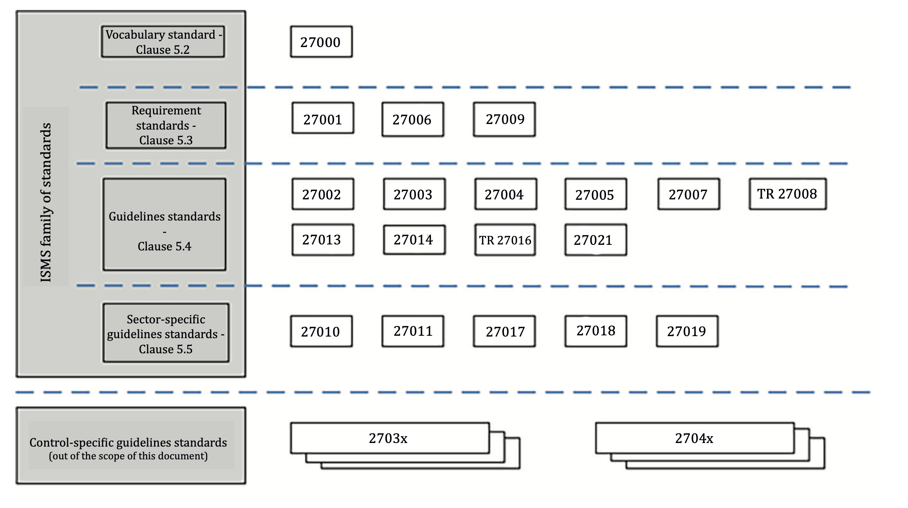
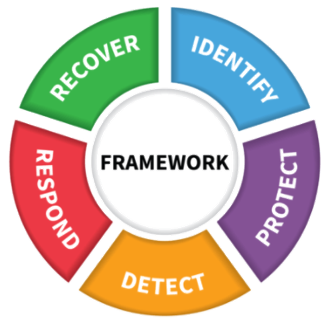
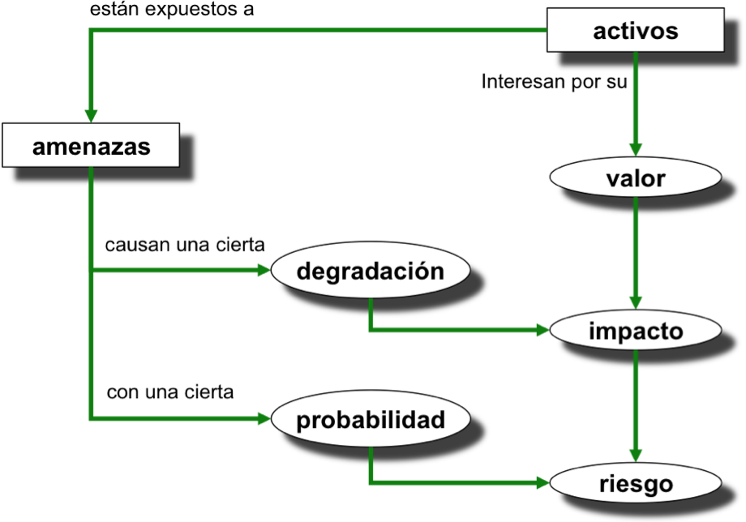
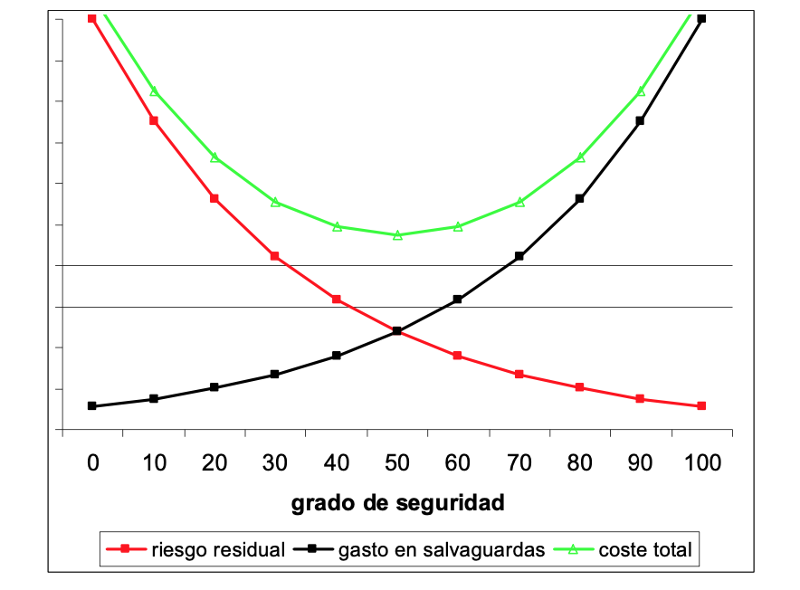

# ⁠3. Sistemas de Gestión de la Seguridad de la Información (SGSI) y Análisis de Riesgos

## ⁠3.1. Introducción al SGSI

Un **Sistema de Gestión de la Seguridad de la Información (SGSI)** es un conjunto de políticas, procedimientos, recursos y técnicas estructuradas que utiliza una organización para gestionar sus riesgos informáticos y proteger sus activos críticos de forma continua.

En lugar de aplicar soluciones aisladas (como instalar un antivirus o un firewall sin una planificación previa), el SGSI propone un **enfoque sistemático y estructurado**. El propósito de un SGSI es preservar la **confidencialidad, integridad y disponibilidad** de la información, inspirando confianza a todas las partes interesadas.

El SGSI debe estar integrado en los procesos de la organización y se basa en el **ciclo de mejora continua ([Ciclo de Deming](https://es.wikipedia.org/wiki/Ciclo_de_Deming))**:

1. **Planificar (Plan):** Evaluar los riesgos, definir el alcance y diseñar la política de seguridad.
2. **Hacer (Do):** Implementar los controles y medidas de seguridad (Plan de Seguridad).
3. **Verificar (Check):** Auditar, monitorizar y supervisar si las medidas funcionan.
4. **Actuar (Act):** Corregir fallos y mejorar el sistema adaptándose a nuevas amenazas.

---

## ⁠3.2. Marco Normativo y Estándares de Seguridad

Para diseñar e implantar un SGSI, las organizaciones no parten de cero, sino que se apoyan en marcos de trabajo y normativas internacionales y nacionales.

### ⁠3.2.1. Familia de normas ISO/IEC 27000

Es el estándar internacional por excelencia para los SGSI. Establece las bases y requisitos para gestionar la seguridad en cualquier tipo de organización.

/// caption
Familia de normas ISO 27000
///

* **ISO/IEC 27000:** Define los términos y conceptos clave (el vocabulario) en la gestión de la seguridad de la información.
* **ISO/IEC 27001:** Define los requisitos que debe cumplir un SGSI. **Es la única norma certificable** por auditores externos.
* **ISO/IEC 27002:** Es un código de buenas prácticas. Proporciona el catálogo de controles de seguridad que la organización puede implementar. En su versión de 2022, los controles se agrupan en 4 temas: Organizacionales, de Personas, Físicos y Tecnológicos.
* **ISO/IEC 27005:** Proporciona directrices específicas para la **Gestión de los Riesgos** en la seguridad de la información.

### ⁠3.2.2. Esquema Nacional de Seguridad (ENS)

El **ENS** (Real Decreto 311/2022) establece las políticas de seguridad para la protección de la información y los servicios ofrecidos por las **Administraciones Públicas españolas**. Su cumplimiento es obligatorio para entidades públicas y para las empresas privadas (proveedores) que trabajen o presten servicios a dichas administraciones.

### ⁠3.2.3. NIST Cybersecurity Framework

Es una guía muy popular desarrollada en EE.UU. para gestionar los riesgos en redes y sistemas. Se centra en cinco funciones clave para un ciclo de mejora continua:

1. **Identificar:** Inventario de activos y riesgos.
2. **Proteger:** Implementación de salvaguardas.
3. **Detectar:** Detección de eventos e incidentes.
4. **Responder:** Actuación ante el incidente.
5. **Recuperar:** Restauración de servicios críticos.

{width=50%}
/// caption
NIST framework
///

### ⁠3.2.4. Guías Nacionales (CCN-CERT e INCIBE)

* El **CCN (Centro Criptológico Nacional)** publica las Guías CCN-STIC, fundamentales para cumplir el ENS en el sector público.
* El **INCIBE (Instituto Nacional de Ciberseguridad)** ofrece guías, decálogos y herramientas orientadas principalmente a ciudadanos y empresas privadas (PYMEs).

---

## ⁠3.3. El Corazón del SGSI: Análisis de Riesgos

El análisis de riesgos es la fase de "Planificación" del SGSI donde se determina qué puede fallar, qué impacto tendría y qué probabilidad hay de que ocurra. 

### ⁠3.3.1. Conceptos clave en el análisis

Para entender el proceso, debemos relacionar varios conceptos fundamentales:

* **Activo:** Lo que queremos proteger (información, servidores, red, personal). Tienen un valor para la empresa.
* **Amenaza:** Lo que puede dañar al activo (virus, incendio, robo, error humano).
* **Vulnerabilidad:** La debilidad que permite a la amenaza actuar (software sin actualizar, puerta sin pestillo).
* **Salvaguarda (o Control):** La medida de protección que instalamos para protegernos.

### ⁠3.3.2. Estimación del Riesgo

El riesgo es la posibilidad de que una amenaza explote una vulnerabilidad y cause un impacto. Matemáticamente se define como:

$$Riesgo = Impacto x Probabilidad$$

* **Impacto:** El daño o degradación que sufriría el activo (pérdida de confidencialidad, integridad o disponibilidad).
* **Probabilidad:** La frecuencia con la que esperamos que ocurra la amenaza.

El siguiente diagrama refleja este proceso:

{width=50%}
/// caption
Proceso de estimación del riesgo (Según metodología Marguerit v3)
///

### ⁠3.3.3. Matriz de evaluación cualitativa

A nivel operativo, en lugar de utilizar cálculos matemáticos complejos, es muy común utilizar escalas cualitativas para evaluar y priorizar el riesgo de forma visual.

| Impacto / Probabilidad | Baja | Media | Alta |
| :--- | :--- | :--- | :--- |
| **Alto** | Riesgo Medio | Riesgo Alto | **Riesgo Crítico** |
| **Medio** | Riesgo Bajo | Riesgo Medio | Riesgo Alto |
| **Bajo** | Riesgo Despreciable | Riesgo Bajo | Riesgo Medio |

* **Zonas Críticas y Altas:** Requieren intervención urgente.
* **Zonas Bajas o Despreciables:** Pueden ser asumidas, pero se deben vigilar periódicamente.

---

## ⁠3.4. Tratamiento de los Riesgos y Plan de Seguridad

Una vez analizado el riesgo, la dirección de la empresa debe establecer un **Plan de Seguridad** y decidir qué estrategia aplicar para cada riesgo identificado. 

### ⁠3.4.1. Opciones de Tratamiento

Existen cuatro estrategias principales frente al riesgo:

1. **Mitigar:** Implementar controles o salvaguardas que reduzcan la probabilidad o el impacto (Ej: instalar un firewall, configurar copias de seguridad).
2. **Evitar:** Eliminar la actividad, servicio o arquitectura que genera el riesgo (Ej: cerrar un puerto expuesto a Internet que no se utiliza).
3. **Transferir:** Compartir o derivar el riesgo a un tercero (Ej: contratar un seguro de ciberseguridad o externalizar el servidor a un proveedor de nube).
4. **Aceptar:** Asumir el riesgo conscientemente sin aplicar controles adicionales. Suele hacerse cuando el coste del tratamiento supera con creces los beneficios o el valor del activo protegido.

### ⁠3.4.2. Riesgo Residual y Equilibrio de Costes

Cuando aplicamos salvaguardas a un riesgo inicial, este disminuye, pero casi nunca desaparece por completo. 

> El **Riesgo Residual** es el riesgo que permanece *después* de haber aplicado las medidas de protección.

La seguridad total no existe y proteger un sistema al 100% es económicamente inviable. Por tanto, la gestión de riesgos busca un **punto de equilibrio óptimo** entre lo que cuesta implantar la medida de seguridad y el riesgo residual que la empresa está dispuesta a aceptar.

{width=50%}
/// caption
Equilibrio óptimo entre coste de las salvaguardas y riesgo residual asumido.
///

Gastar demasiado para reducir un riesgo mínimo es ineficiente, igual que gastar muy poco y dejar a la organización expuesta a un impacto fatal.

---

## ⁠3.5. Auditorías de Seguridad

Las auditorías corresponden a la fase de **Verificación (Check)** dentro del ciclo del SGSI. 

Una **auditoría de seguridad** es un proceso sistemático e independiente para evaluar si las medidas de protección y el propio SGSI están funcionando correctamente, cumpliendo con las normativas (como el RGPD o el ENS) y las políticas internas de la empresa.

### ⁠3.5.1. Tareas habituales en una auditoría:
* Revisión de políticas, normativas y configuración de sistemas.
* Análisis de vulnerabilidades y gestión de permisos/usuarios.
* **Pruebas de penetración (Pentesting):** Simulaciones controladas de ciberataques para comprobar la resistencia real de los sistemas.
* Redacción de un **Informe de Resultados** que detalle los hallazgos (no conformidades) y proponga acciones de mejora.

Las auditorías permiten la **detección temprana**, validan el modelo de seguridad ante terceros (certificaciones ISO 27001) y alimentan el ciclo de mejora continua del SGSI.

---
## Ejercicios <!-- skip -->

-  [Ej 3.1 Familia de normas ISO/IEC 27000](Tareas/3.1.familiaiso27000.md)

---

# Bibliografía <!-- skip -->

* ISO/IEC 27000: Descripción de las normas de la familia y definiciones de vocabulario 
	* [https://standards.iso.org/ittf/PubliclyAvailableStandards/c073906_ISO_IEC_27000_2018_E.zip](https://standards.iso.org/ittf/PubliclyAvailableStandards/c073906_ISO_IEC_27000_2018_E.zip)
* Esquema Nacional de Seguridad (ENS): [https://www.ens.es/](https://www.ens.es/)
* European Union Agency for Cybersecurity (ENISA): [https://www.enisa.europa.eu/](https://www.enisa.europa.eu/)
* Libros de MAGERIT v3 (Metodología de Análisis de Riesgos): [Administración Electrónica - MAGERIT](https://administracionelectronica.gob.es/pae_Home/pae_Documentacion/pae_Metodolog/pae_Magerit.html).
