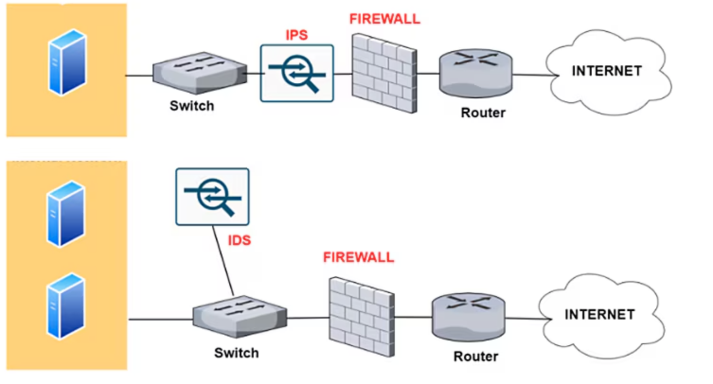

# Sistemas de detección y prevención de intrusiones (IDS/IPS)

Los sistemas **IDS** (Intrusion Detection System) e **IPS** (Intrusion Prevention System) son herramientas fundamentales en cualquier estrategia de ciberseguridad. Un IDS desempeña la función de **“mirar y avisar”** cuando detecta actividad sospechosa o patrones de ataque, mientras que un IPS, además de detectar, puede **“actuar”** bloqueando o mitigando el peligro de manera automática.

Los **IDS** e **IPS** constituyen un pilar esencial en la seguridad de redes y sistemas. Mientras el primero ofrece capacidad de detección y notificación, el segundo añade el componente de respuesta inmediata para cortar o bloquear amenazas al vuelo. Para maximizar su eficacia, es importante:

1. Configurarlos de forma correcta según el entorno, ajustando reglas y políticas a la realidad de la organización.
2. Mantener actualizadas las bases de datos de firmas y revisar periódicamente los perfiles de comportamiento para reducir falsos positivos.
3. Integrarlos con el resto de mecanismos de seguridad (firewalls, SIEM, antivirus, etc.) para lograr una protección holística.

La siguiente imagen ilustra la diferencia en el funcionamiento de un IPS, frente a un IDS. El IDS solamente observa el tráfico (Conectado a un puerto SPAN o TAP de red) mientras que el IPS se interpone entre la red y el router permitiendo actuar en caso de detección de amenazas.

{:style="width: 80%;" class="center"}

Los puertos **SPAN** y los dispositivos **TAP** se usan para monitorizar redes, pero tienen diferencias clave: un **TAP** es un dispositivo físico que copia todo el tráfico sin pérdida ni impacto en el rendimiento de la red, ideal para entornos críticos, aunque más costoso y menos flexible. En cambio, un **SPAN** es una función del switch que duplica el tráfico de ciertos puertos o VLANs hacia otro puerto, siendo más económico y fácil de configurar, pero puede perder paquetes bajo alta carga y consumir recursos del switch. La elección depende de la precisión y los recursos necesarios

## 1 Diferencias básicas entre IDS y IPS

La principal diferencia radica en la **capacidad de intervención**. Un **IDS** monitoriza el tráfico o los eventos del sistema y **alerta** ante comportamientos que coincidan con ataques conocidos o anomalías. No bloquea directamente el ataque, sino que delega la decisión al equipo de seguridad o a otros sistemas. Por el contrario, un **IPS** no solo detecta amenazas, sino que también **toma medidas activas**: corta conexiones, descarta paquetes sospechosos, bloquea direcciones IP maliciosas o modifica reglas de firewall, reduciendo al mínimo el tiempo de exposición al ataque.

## 2 ¿Por qué son importantes?

Contar con soluciones de IDS e IPS permite a las organizaciones reforzar la seguridad de sus redes y sistemas críticos de varias maneras:

- **Protección continua**: La detección (IDS) y, sobre todo, la prevención (IPS) pueden frenar ataques antes de que causen daños significativos.
- **Monitorización y registro**: Facilitan la recopilación de datos sobre intentos de intrusión e incidentes de seguridad, valiosos para auditorías, investigación forense y mejora de las políticas de seguridad.
- **Adaptación a amenazas nuevas**: Muchos IDS/IPS modernos incluyen módulos de aprendizaje automático o análisis de comportamiento que ayudan a descubrir amenazas desconocidas o variantes de ataques.
- **Cumplimiento normativo**: Regulaciones como PCI-DSS o GDPR exigen, o al menos recomiendan, medidas de protección activa e inteligente de los datos.

## 3 Ejemplos de uso

- **En redes corporativas**: Para detectar intentos de acceso no autorizado y, en el caso de un IPS, bloquearlos de inmediato.
- **En servidores de aplicaciones web**: Para prevenir inyecciones SQL, ataques de Cross-Site Scripting (XSS) o cualquier otra táctica dirigida a comprometer aplicaciones en producción.
- **Entornos de teletrabajo o BYOD**: Para supervisar multitud de dispositivos conectados y controlar el perímetro corporativo de forma segura.

## 4 Clasificación y funcionamiento

Tanto los IDS como los IPS se pueden clasificar en función de **dónde** operan y **cómo** detectan las amenazas. La gran diferencia es que el IDS se limita a alertar, mientras que el IPS añade un paso más y puede bloquear.

### 4.1 Clasificación según el lugar donde operan

**a) Sistemas basados en red (NIDS/NIPS)**  
Operan en puntos estratégicos de la red (enrutadores, conmutadores, firewalls) y analizan el tráfico en tiempo real.

- Un **NIDS** (Network-based IDS) detecta patrones maliciosos y alerta a los administradores cuando algo encaja con un ataque conocido o un comportamiento anómalo.
- Un **NIPS** (Network-based IPS) hace lo mismo, pero puede bloquear o filtrar paquetes sospechosos antes de que lleguen a su destino.

**b) Sistemas basados en host (HIDS/HIPS)**  
Se instalan directamente en un equipo (servidor, estación de trabajo) para monitorizar logs, procesos y la integridad de archivos.

- Un **HIDS** (Host-based IDS) se centra en la detección, avisando si se descubre actividad anómala en el propio sistema.
- Un **HIPS** (Host-based IPS) añade la capacidad de detener procesos o bloquear conexiones maliciosas de manera inmediata.

**c) Sistemas inalámbricos (WIPS)**  
Especializados en redes Wi-Fi, los **Wireless IPS** (WIPS) detectan y previenen intrusiones relacionadas con ataques a puntos de acceso, suplantaciones de identidad o vulnerabilidades específicas de entornos inalámbricos.

**d) Enfoques híbridos o distribuidos**  
Algunas soluciones combinan **NIDS** y **HIDS**, o bien **NIPS** y **HIPS**, gestionándose desde una consola central que correlaciona eventos de la red y de los hosts. Esto ofrece una visión global y una mayor capacidad de respuesta.

### 4.2 Clasificación según el método de detección

**a) Basados en firmas (Signature-based)**  
Comparan el tráfico o los eventos con una base de datos de patrones conocidos de ataques (similar a un antivirus). Son muy eficaces contra amenazas ya registradas, pero pueden pasar por alto variantes nuevas o desconocidas. Se requiere actualización constante de las firmas para no quedar obsoletos.

**b) Basados en anomalías (Anomaly-based)**  
Establecen un perfil de comportamiento “normal” y generan alertas cuando detectan desviaciones significativas. Tienen la ventaja de reconocer ataques novedosos, pero suelen producir más **falsos positivos** si la línea base no se define o ajusta correctamente.

**c) Basados en políticas o reglas (Policy-based)**  
Se configuran con reglas específicas dictadas por la organización. Cuando se incumple alguna norma de seguridad, el sistema alerta (IDS) o bloquea (IPS). Son muy flexibles pero requieren un mantenimiento constante para adaptar las políticas a las necesidades reales de la empresa.

**d) Híbridos**  
Combina varias técnicas (firmas, anomalías y/o políticas) para disminuir los falsos positivos y cubrir un mayor espectro de amenazas, incluyendo tanto ataques conocidos como desconocidos.

## 5 Limitaciones y consideraciones

A pesar de su eficacia, los IDS/IPS tienen limitaciones que deben gestionarse adecuadamente:

- **Configuración y ajuste continuo**: Cada entorno de red o servidor tiene características únicas. Un IDS/IPS mal configurado puede disparar alertas excesivas o, por el contrario, ignorar ataques.
- **Falsos positivos y falsos negativos**:
    - **Falsos positivos**: Alertas o bloqueos de tráfico legítimo, algo que provoca frustración en los usuarios y puede entorpecer la operativa.
    - **Falsos negativos**: Fallos en la detección de ataques reales, lo que puede derivar en incidentes graves de seguridad.
- **Dependencia de las firmas o de un perfil “normal”**: Si no se actualizan las bases de datos o no se corrige el modelo de anomalías, hay más riesgo de que ataques novedosos pasen desapercibidos.
- **Integración con otras soluciones**: Resulta clave combinar IDS/IPS con cortafuegos, sistemas antimalware, soluciones SIEM (Security Information and Event Management) y procedimientos de respuesta a incidentes. Una estrategia de “defensa en profundidad” optimiza el alcance y la eficacia de cualquier IDS/IPS.

## 6 Técnicas de evasión de IDS

Existen numerosas técnicas que los intrusos pueden emplear para evitar la detección por parte de los IDS (Sistemas de Detección de Intrusos). Estos métodos plantean desafíos para los IDS, ya que están diseñados para eludir los métodos de detección existentes:

### 6.1 Fragmentación

La fragmentación divide un paquete en paquetes más pequeños y fragmentados. Esto permite que un intruso permanezca oculto, ya que no habrá una firma de ataque detectable.

Los paquetes fragmentados son reconstruidos posteriormente por el nodo receptor en la capa IP y luego se reenvían a la capa de aplicación. Los ataques de fragmentación generan paquetes maliciosos reemplazando los datos en los paquetes fragmentados constituyentes con datos nuevos.

### 6.2 Inundación (Flooding)

Este ataque está diseñado para saturar el detector, provocando el fallo del mecanismo de control. Cuando el detector falla, se permite el paso de todo el tráfico.

Una forma común de causar inundación es suplantando el Protocolo de Datagrama de Usuario (UDP) y el Protocolo de Mensajes de Control de Internet (ICMP) legítimos. La inundación de tráfico se utiliza entonces para camuflar las actividades anómalas del atacante. Como resultado, el IDS tendría grandes dificultades para identificar paquetes maliciosos en un volumen abrumador de tráfico.

### 6.3 Ofuscación

La ofuscación puede ser utilizada para evitar la detección al hacer que un mensaje sea difícil de entender, ocultando así un ataque. En términos generales, la ofuscación consiste en alterar el código de un programa de manera que mantenga su funcionalidad pero sea indistinguible.

El objetivo es reducir la detectabilidad frente a procesos de ingeniería inversa o análisis estático, dificultando su interpretación y comprometiendo su legibilidad. Por ejemplo, ofuscar malware permite que este evada los IDS.

### 6.4 Cifrado

El cifrado ofrece múltiples capacidades de seguridad, incluidas la confidencialidad, integridad y privacidad de los datos. Sin embargo, los creadores de malware utilizan estas características de seguridad para ocultar ataques y evadir la detección.

Por ejemplo, un ataque en un protocolo cifrado no puede ser leído por un IDS. Cuando el IDS no puede asociar el tráfico cifrado con las firmas existentes en su base de datos, el tráfico cifrado no se detecta. Esto hace que sea extremadamente difícil para los detectores identificar los ataques.

## 7 IDS/IPS de código abierto

### 7.1 **Snort (IDS/IPS)**

Snort es una herramienta ampliamente utilizada en ciberseguridad como sistema de detección y prevención de intrusiones (IDS/IPS). Este software analiza en tiempo real el tráfico de red con el fin de identificar patrones sospechosos, ataques o actividades no autorizadas que puedan comprometer la seguridad de una infraestructura.

{:style="width: 50%;" class="center"}

Snort sigue siendo una de las herramientas más empleadas en el ámbito de la ciberseguridad gracias a su flexibilidad, al respaldo de Cisco y a una activa comunidad de usuarios y desarrolladores. Su capacidad para evolucionar mediante la actualización constante de reglas y su integración con otras soluciones de seguridad hacen de Snort una opción sólida en la protección de redes e infraestructuras de cualquier tamaño.

#### 7.1.1 Historia de Snort

Snort fue creado originalmente por Martin Roesch en 1998. Con el tiempo, se convirtió en una de las soluciones más populares para la detección de intrusiones gracias a su eficacia y a su modelo de código abierto.

En el año 2013, Cisco adquirió la empresa Sourcefire, fundada por Roesch, incorporando a Snort en su cartera de productos de ciberseguridad. Desde entonces, Cisco ha integrado Snort en su ecosistema de seguridad, por ejemplo, en dispositivos **Firepower** y otros productos de red.

#### 7.1.2 Principales características de Snort

- **Análisis de paquetes en profundidad**: Inspecciona cada paquete de red para detectar actividades sospechosas o maliciosas.
- **Uso de reglas personalizables**: Permite escribir y adaptar reglas específicas a las necesidades de cada entorno de red.
- **Capacidades IDS e IPS**: Puede configurarse únicamente para detectar intrusiones (IDS) o para prevenirlas de forma proactiva, bloqueando el tráfico malicioso (IPS).

#### 7.1.3 Reglas de detección: Talos

Las capacidades de detección de Snort dependen en gran medida de las reglas que definen los patrones de tráfico malicioso. **Cisco Talos**, el equipo de inteligencia de amenazas de Cisco, ofrece un conjunto de reglas altamente optimizadas y actualizadas que permiten a Snort detectar las amenazas más recientes.

- Es posible suscribirse a las reglas de Talos mediante un servicio de suscripción que proporciona acceso prioritario a actualizaciones de reglas y soporte adicional, garantizando la protección frente a amenazas emergentes.
- Existe también la opción de utilizar un conjunto de reglas básicas de forma gratuita, aunque con actualizaciones menos frecuentes.

#### 7.1.4 Usos comunes

- **Protección de redes empresariales** contra ataques conocidos.
- **Análisis y monitorización del tráfico** en tiempo real.
- **Soporte en investigaciones forenses** para entender el comportamiento de amenazas y reconstruir incidentes de seguridad.

#### 7.1.5 Ventajas

- **Amplia comunidad y soporte continuo**: Su gran base de usuarios y desarrolladores, unida al respaldo de Cisco, facilita el intercambio de soluciones y la incorporación de mejoras constantes.
- **Altamente personalizable**: Sus reglas se pueden adaptar de manera flexible a distintas necesidades y entornos de red.
- **Modelo de código abierto**: Facilita la transparencia y la colaboración, siendo especialmente atractivo para entornos educativos y de investigación.

#### 7.1.6 Inconvenientes

- **Curva de aprendizaje**: Su configuración y mantenimiento requieren conocimientos avanzados, lo que puede resultar complejo para personal sin experiencia previa.
- **Dependencia de reglas actualizadas**: Para ser efectivo, Snort necesita reglas bien definidas y actualizadas; la suscripción a Talos mejora esta faceta, pero la versión gratuita recibe las actualizaciones con menor frecuencia.
- **Rendimiento en redes de gran volumen**: La inspección en profundidad de un gran número de paquetes puede exigir hardware potente y ajustes de optimización para evitar retrasos en la red.

### 7.2 **Suricata (IDS/IPS)**

Suricata es una herramienta de ciberseguridad que, al igual que Snort, actúa como un sistema de detección y prevención de intrusiones (IDS/IPS). Fue desarrollada y mantenida por la **Open Information Security Foundation (OISF)** y se caracteriza por su capacidad de inspeccionar el tráfico de red en tiempo real para identificar y bloquear amenazas.

{:style="width: 50%;" class="center"}

Suricata se ha consolidado como una alternativa sólida y de alto rendimiento a otras herramientas de IDS/IPS. Su filosofía de código abierto, combinada con un enfoque multihilo y un conjunto de reglas robustas, lo convierten en un recurso fundamental para quienes buscan soluciones escalables de detección y prevención de intrusiones.
#### 7.2.1 Historia de Suricata

El proyecto Suricata comenzó en 2009 bajo el apoyo del Departamento de Seguridad Nacional de Estados Unidos (DHS), entre otros patrocinadores, con el objetivo de crear una alternativa de código abierto que fuera escalable y capaz de manejar grandes volúmenes de tráfico de red. Desde entonces, ha evolucionado rápidamente gracias a la participación activa de la comunidad y de la OISF, que publican actualizaciones frecuentes para mejorar su rendimiento y sus funcionalidades.

#### 7.2.2 Principales características de Suricata

- **Motor multihilo y multiproceso**: Suricata aprovecha al máximo los recursos de hardware (CPU y memoria), distribuyendo la carga de trabajo entre múltiples hilos y procesos para inspeccionar el tráfico con mayor eficiencia.
- **Análisis de paquetes en profundidad (Deep Packet Inspection)**: Permite examinar no solo las cabeceras de los paquetes, sino también el contenido de las cargas útiles (payloads).
- **IDS/IPS y monitorización de flujos**: Se puede configurar para solo detectar intrusiones o, además, bloquearlas de forma activa, y ofrece capacidades avanzadas de análisis de flujo de red.
- **Detección de malware y archivos**: Suricata puede extraer archivos de flujos HTTP u otros protocolos para analizarlos con herramientas de antivirus o plataformas de análisis de malware.

#### 7.2.3 Reglas de detección: Emerging Threats

Al igual que Snort utiliza reglas de Talos, Suricata se basa en **reglas compatibles con el formato de Snort**, con la ventaja de que también cuenta con un amplio soporte de la comunidad. La **comunidad Emerging Threats** (ET) proporciona:

- **Reglas gratuitas**: Un conjunto básico de reglas que se actualiza periódicamente y cubre amenazas comunes.
- **Suscripción avanzada**: Acceso prioritario a un repositorio más amplio de reglas y actualizaciones frecuentes, lo que permite detectar amenazas emergentes con mayor rapidez.

Además, Suricata es capaz de leer tanto reglas de Snort como reglas específicas optimizadas para su propio motor.

#### 7.2.4 Usos comunes

- **Protección de redes empresariales** frente a ataques conocidos y amenazas emergentes.
- **Monitorización continua** del tráfico para detectar comportamientos anómalos.
- **Análisis forense de incidentes de seguridad**: Gracias a su capacidad para extraer y analizar archivos y flujos, facilita la investigación en profundidad.
- **Integración con otras herramientas de seguridad**: Suricata se puede acoplar a sistemas SIEM (Security Information and Event Management) y otras plataformas de ciberseguridad.

#### 7.2.5 Ventajas

- **Elevado rendimiento en sistemas multinúcleo**: Gracias a su arquitectura multihilo, puede procesar grandes volúmenes de tráfico sin afectar significativamente al rendimiento de la red.
- **Compatibilidad de reglas**: Permite usar reglas de Snort y, al mismo tiempo, aprovechar reglas específicas de Suricata.
- **Comunidad activa y en crecimiento**: La OISF y la comunidad de desarrolladores ofrecen actualizaciones y mejoras constantes, así como soporte a usuarios.
- **Mayor visibilidad del tráfico**: Su capacidad para inspeccionar en profundidad, extraer archivos y analizar flujos lo hace muy interesante para entornos en los que se requiere un conocimiento exhaustivo de la actividad de la red.

#### 7.2.6 Inconvenientes

- **Configuración y mantenimiento avanzados**: Exige ciertos conocimientos técnicos para aprovechar al máximo su potencial multihilo y afinar su rendimiento.
- **Requerimientos de hardware**: Para grandes volúmenes de tráfico, se necesitan recursos significativos en cuanto a CPU y memoria.
- **Dependencia de reglas actualizadas**: Como cualquier IDS/IPS basado en firmas, su eficacia depende de tener las reglas más recientes que cubran las últimas amenazas.

### 7.3 **Comparativa entre Snort y Suricata**

A la hora de implementar un sistema de detección y prevención de intrusiones (IDS/IPS), Snort y Suricata son dos de las opciones más populares en el ámbito de la ciberseguridad. Ambas herramientas ofrecen prestaciones similares, pero existen diferencias notables en términos de rendimiento, facilidad de uso y adopción empresarial.

 Si bien **Snort** continúa siendo el referente clásico y ampliamente adoptado en el sector empresarial —en gran parte gracias al respaldo de Cisco—, **Suricata** se posiciona como una alternativa muy robusta para quienes priorizan la escalabilidad y el rendimiento en redes de alto tráfico.
 
Ambos sistemas ofrecen versiones de código abierto con comunidades activas y potentes conjuntos de reglas, por lo que la elección de uno u otro dependerá de las necesidades concretas de la organización, la infraestructura disponible y el nivel de conocimiento del equipo encargado de la seguridad.

#### 7.3.1 Origen y respaldo

- **Snort**:
    - Creado en 1998 por Martin Roesch.
    - Adquirido en 2013 por Cisco, que ofrece soporte y lo integra en sus productos de seguridad (ej.: Cisco Firepower).
    - Posee una amplia comunidad de desarrolladores y usuarios que contribuyen a mejorar el motor de Snort y su conjunto de reglas.
- **Suricata**:
    - Desarrollado a partir de 2009 por la Open Information Security Foundation (OISF).
    - Respaldado por distintas organizaciones, incluidas agencias gubernamentales de Estados Unidos, y cuenta con el soporte de una comunidad activa.
    - Nació con la idea de ser una alternativa más escalable y preparada para altos volúmenes de tráfico.

#### 7.3.2 Rendimiento

- **Snort**:
    - Su arquitectura monohilo (en versiones anteriores a Snort 3) puede presentar limitaciones a la hora de procesar un gran volumen de paquetes en redes de alto rendimiento.
    - Snort 3 introduce mejoras sustanciales de eficiencia y modularidad, pero su adopción está en evolución.
- **Suricata**:
    - Diseñado con una arquitectura multihilo desde el principio, lo que le permite repartir la carga de trabajo entre múltiples núcleos del procesador.
    - Suele mostrar ventajas en entornos con gran volumen de tráfico gracias a su capacidad de paralelizar la inspección.

#### 7.3.3 Reglas de detección

- **Snort**:
    - Utiliza principalmente reglas de **Cisco Talos**.
    - Dispone de un repositorio gratuito con actualizaciones, aunque para tener las más recientes y soporte prioritario se ofrece un servicio de suscripción.
    - Es posible crear o modificar reglas de manera personalizada, lo que aporta flexibilidad.
- **Suricata**:
    - Puede trabajar con reglas en formato Snort, lo que facilita la migración de un sistema al otro.
    - Existen también reglas específicas de Suricata optimizadas para su motor.
    - **Emerging Threats** (ET) es la fuente más popular de reglas para Suricata (y también para Snort). Ofrece tanto versiones gratuitas como de suscripción.

### 7.4 Facilidad de uso y configuración

- **Snort**:
    - Al ser más veterano, existe mucha documentación, foros y tutoriales para su configuración.
    - La curva de aprendizaje puede ser moderada, ya que requiere un manejo cuidadoso de archivos de configuración y reglas.
- **Suricata**:
    - Su configuración multihilo puede ser algo más compleja al principio, pues hay que ajustar adecuadamente los hilos de procesamiento según el hardware disponible.
    - No obstante, ofrece características muy potentes de inspección de archivos y flujos que pueden resultar muy útiles en entornos corporativos.

### 7.5 Adopción en el ámbito empresarial

- **Snort**:
    - Es uno de los IDS/IPS más utilizados a nivel mundial.
    - La adquisición por parte de Cisco supuso una gran difusión y presencia en grandes empresas.
    - Se integra de forma nativa en muchos productos comerciales de Cisco, lo que facilita su adopción en entornos corporativos que ya utilizan esta marca.
- **Suricata**:
    - Ha ido ganando presencia en entornos empresariales gracias a su rendimiento en redes de gran tamaño.
    - Es muy valorado por su enfoque multihilo, permitiéndole gestionar altos volúmenes de tráfico sin comprometer tanto el rendimiento.
    - Muchas organizaciones y proveedores de seguridad han comenzado a incluir Suricata dentro de sus soluciones, sobre todo en entornos donde la capacidad de escala es prioritaria.

## 8 IDS/IPS comerciales

- [**Check Point Quantum IPS:**](https://www.checkpoint.com/quantum/intrusion-prevention-system-ips/) Un sistema IPS comercial que ofrece una protección completa contra amenazas conocidas y desconocidas. Check Point Quantum IPS utiliza una combinación de tecnologías de seguridad, como la inspección profunda de paquetes, el análisis de comportamiento y la inteligencia de amenazas, para detectar y bloquear una amplia gama de amenazas .  
    
- [**Cisco NGIPS:**](https://www.cisco.com/c/en_ca/products/security/ngips/index.html) Un sistema IPS comercial que se integra con otras soluciones de seguridad de Cisco para proporcionar una protección completa. Cisco NGIPS ofrece una prevención de intrusiones de próxima generación con funciones avanzadas como la prevención de exploits y el filtrado de URL .  
    
- [**Palo Alto Networks:**](https://www.paloaltonetworks.es/network-security) Un sistema IPS comercial que ofrece una prevención de intrusiones de próxima generación con funciones avanzadas como la prevención de exploits y el filtrado de URL. Palo Alto Networks utiliza una combinación de tecnologías de seguridad, como la inspección profunda de paquetes, el análisis de comportamiento y la inteligencia de amenazas, para detectar y bloquear una amplia gama de amenazas .  
    
- [**Trellix Network Security:**](https://www.trellix.com/es-es/products/network-security/) es una solución avanzada de ciberseguridad diseñada para detectar, bloquear y responder a amenazas sofisticadas, incluyendo ataques dirigidos y técnicas evasivas. Utiliza una combinación de aprendizaje automático, inteligencia artificial y motores de correlación para identificar y mitigar amenazas en tiempo real 
   
- [**Zscaler Cloud IPS:**](https://www.zscaler.com/es/products-and-solutions/cloud-ips) Un sistema IPS basado en la nube que proporciona una protección completa contra amenazas para empresas de todos los tamaños. **Zscaler Cloud IPS** ofrece prevención de intrusiones siempre activa y entregada desde la nube para garantizar la seguridad empresarial. Zscaler realiza una inspección completa de TLS/SSL sin afectar al rendimiento. Esto permite llevar a cabo detección basada en firmas, detección basada en políticas y detección basada en anomalías.

## 9 Bibliografía

* [Snort vs Suricata](https://www.netgate.com/blog/suricata-vs-snort)
- [Snort](https://www.snort.org/)
- [Suricata](https://suricata.io/)
- [Emerging Threads Rules](https://rules.emergingthreats.net/)

<!--
https://www.palentino.es/blog/comparacion-y-relacion-entre-ids-ips-siem-y-otras-soluciones-de-ciberseguridad/

https://expertinsights.com/insights/top-intrusion-prevention-systems/

- [Palo Alto: Qué es un IDS/IPS](https://www.paloaltonetworks.lat/cyberpedia/what-is-an-intrusion-detection-system-ids)

https://www.paloaltonetworks.lat/cyberpedia/what-is-an-intrusion-prevention-system-ips

-->

<!--

Existen varios fabricantes reputados de TAPs de red que ofrecen soluciones de alta calidad para la monitorización y seguridad de redes. A continuación, se presentan algunos de ellos:

- **Keysight Technologies**: Ofrece una amplia gama de TAPs de red, incluyendo opciones para cobre y fibra óptica, diseñadas para proporcionar visibilidad completa del tráfico de red y mantener un rendimiento y seguridad óptimos.
    
    [Keysight](https://www.keysight.com/us/en/products/network-visibility/network-taps.html?utm_source=chatgpt.com)
    
- **Garland Technology**: Especializada en TAPs de red que garantizan una captura de datos del 100% en tiempo real, proporcionando visibilidad continua y sin interrupciones del tráfico de red.
    
    [Garland Network](https://www.garlandtechnology.com/network-tap?utm_source=chatgpt.com)
    
- **USRobotics**: Ofrece una variedad de TAPs de red, incluyendo TAPs de cobre y fibra, que son totalmente pasivos, no intrusivos e invisibles para la red, ideales para la monitorización en tiempo real del tráfico entre dispositivos críticos.
    
    [USR EMEA](https://www.usr-emea.com/products/p-taps-menu.asp?loc=span&utm_source=chatgpt.com)
    
- **NETSCOUT**: Proporciona TAPs que ofrecen acceso completo al tráfico de red para dispositivos de monitorización, con múltiples opciones para diversos tipos de enlaces y velocidades, diseñados para una monitorización continua y completa.
    
    [NetScout](https://www.netscout.com/product/packet-flow-switches-and-taps/netscout-taps?utm_source=chatgpt.com)
    
- **Network Critical**: Ofrece soluciones flexibles y completamente modulares de Network Packet Brokers y TAPs de red, adaptadas para satisfacer las necesidades de acceso y visibilidad de su red.
    
    [Network Critical](https://www.networkcritical.com/packet-brokers-product-list?lang=es&utm_source=chatgpt.com)
    

Estos fabricantes son reconocidos por la calidad y fiabilidad de sus productos en el ámbito de la monitorización y seguridad de redes.

-->