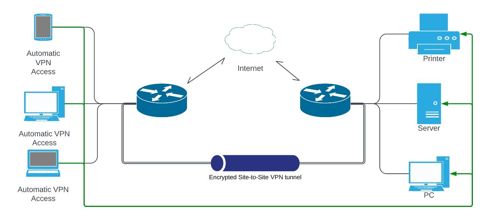
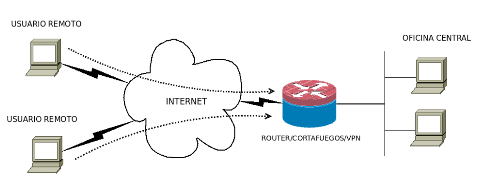
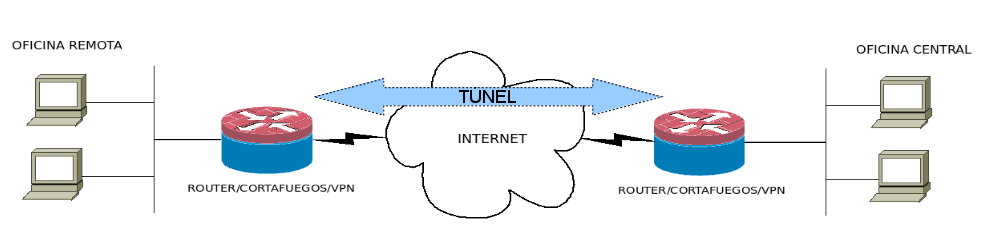
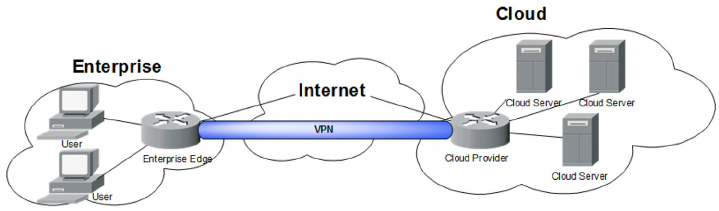

<!-- .slide: data-background="#2C3E50" -->

## 4. Redes Privadas Virtuales (VPN)

---

### Definición de VPN:

Una Red Privada Virtual o **VPN (Virtual Private Network)** es una tecnología que permite la creación de un **canal de comunicación seguro y encriptado** sobre una red pública o no confiable, como Internet. 

--

<!-- .element width="70%" -->

--

### Componentes clave de una VPN en redes empresariales

--

#### 1. **Protocolo de túnel**
    
   - Encapsula los paquetes de datos en un nuevo paquete, permitiendo que viajen de forma segura por la red pública.
   - **Ejemplos**: **IPSec**, **L2TP**, **SSL/TLS**.

#### 2. **Cifrado**
   
- Asegura que los datos transmitidos no puedan ser leídos por terceros no autorizados.
- **Algoritmos comunes**: **AES (Advanced Encryption Standard)**, **3DES**, **RSA**.

--

#### 3. **Autenticación**
   
 - Verifica la identidad de los usuarios o dispositivos antes de permitir el acceso a la red.
- **Métodos**: Certificados digitales, autenticación basada en contraseñas, autenticación multifactor (MFA).

#### 4. **Redireccionamiento de tráfico**
    
- Los paquetes transmitidos entre los puntos finales de la VPN pasan a través de un túnel virtual, ocultando la información de la red interna.

--

#### 5. **Conexiones remotas seguras**
    
- Permite que empleados o dispositivos externos accedan a la red interna de una empresa como si estuvieran físicamente presentes.

---

### Tipos de VPN más utilizados

--

#### 1. **IPsec (Internet Protocol Security)**    

   - Funciona en la capa de red (capa 3).
   - Autenticación (AH) y cifrado (ESP).
   - Utilizado para conexiones site-to-site o entre clientes y concentradores VPN.

--

#### 2. **SSL/TLS VPN (Secure Sockets Layer)**    
   
   - Usa TLS/SSL (capa de transporte).
   - Orientado a acceso remoto; con frecuencia accesible vía navegador web o cliente ligero.
   - Ej: OpenVPN, Wireguard

--

#### 1. **L2TP (Layer 2 Tunneling Protocol)**    

- Normalmente se combina con IPsec (L2TP/IPsec) para añadir cifrado.
- Requiere configuración en el servidor y en el cliente para encapsular la capa 2.

---

### Ventajas e inconvenientes de VPN

--

### Ventajas de una VPN empresarial

- **Seguridad**: Protege datos sensibles contra interceptaciones en redes públicas.
- **Acceso remoto seguro**: Posibilita que los empleados trabajen desde cualquier lugar.
- **Ahorro de costes**: Evita la necesidad de conexiones dedicadas como circuitos MPLS.
- **Escalabilidad**: Fácil incorporación de nuevas ubicaciones o usuarios.

--
 
### Inconvenientes de VPN empresarial

1. **Coste de infraestructura y mantenimiento**  
2. **Complejidad de configuración**  
    - Configuraciones personalizadas según necesidades  
    - Actualizaciones frecuentes (servidores, clientes)
3. **Rendimiento y latencia**  
    - Sobrecarga por cifrado y descifrado  
    - Latencia por ubicación de servidores
4. **Dependencia de la conexión a Internet**  
    - Vulnerabilidad ante cortes o inestabilidad de la red pública  

--

5. **Riesgos de seguridad por errores de configuración**  
    - Puertas traseras o configuraciones inseguras  
    - Gestión deficiente de contraseñas y certificados
6. **Escalabilidad limitada o costosa**  
    - Necesidad de licencias y equipos adicionales  
    - Reconfiguración compleja al aumentar el número de usuarios
	- Necesidades de ancho de banda
7. **Incompatibilidades con otros servicios**  
    - Bloqueos en redes corporativas (puertos y protocolos)  
    - Sistemas heredados que no soportan nuevos protocolos de cifrado

---

## Configuraciones típicas

--

### 1. Acceso remoto (dialup)

- Empleado que se conecta desde su hogar u otra ubicación externa a la red corporativa.
- Se configura un cliente VPN (p.ej., OpenVPN Client) con las credenciales y parámetros de cifrado.
- Se habilita la conexión a recursos internos (servidores de archivos, aplicaciones empresariales).

<!-- .element width="60%" -->

--

### 2. Site-to-site

- Conexión de dos o más sedes de una empresa a través de túneles VPN permanentes.
- Cada sede implementa un router/firewall con IPsec VPN, permitiendo que las subredes se vean como si estuvieran en la misma LAN.

<!-- .element width="60%" -->

--

### 3. VPN basada en la nube

- Utiliza proveedores de servicios VPN para establecer conexiones seguras entre la infraestructura empresarial local y los servicios en la nube.

<!-- .element width="60%" -->

---

## Retos y soluciones prácticas

--

- **Rendimiento y cifrado**    
    - Cuanto mayor sea la fuerza del cifrado (p.ej., AES-256), mayor carga computacional.
    - Posible solución: equilibrar rendimiento y seguridad según las necesidades.

--

- **Split tunneling vs. full tunneling**
    
    - **Split tunneling**: solo el tráfico hacia la LAN corporativa viaja por la VPN.
    - **Full tunneling**: todo el tráfico del usuario pasa por la VPN. Mayor seguridad pero más latencia.

--

- **Fugas de DNS**
    
    - Asegurar que las consultas DNS viajan cifradas por la VPN y no por la conexión local.
    - Configuración de servidores DNS internos o seguros.

--

- **Autenticación multifactor (MFA)**
    
    - Uso de tokens físicos/virtuales, apps de autenticación, etc. para reforzar la seguridad del acceso remoto.

---

## ¿Por qué han proliferado las VPN basadas en TLS?

- Soluciones **más simples de desplegar**
- **Menos problemáticas con NAT**
- **Accesibles en una amplia gama de entornos**.

 Sin embargo, **IPsec** no ha desaparecido; ambas coexisten, cada una con sus ventajas y desventajas específicas.

--

### Distintas capas de operación:

- **IPsec** actúa a nivel de red: protegiendo todo el tráfico IP. Ideal para enlaces entre redes (site-to-site), pero con mayor complejidad de implementación.

- **SSL/TLS** actúa en capas superiores (transporte-aplicación): más sencillo de configurar y su tráfico (similar a HTTPS) atraviesa cortafuegos y NAT con menos fricción.

--

### Razones de su popularidad

1. **Facilidad de configuración y despliegue**
2. **Compatibilidad con NAT y cortafuegos**
3. **Menor complejidad administrativa**
4. **Mayor portabilidad**
5. **Uso del puerto 443** (tráfico HTTPS)
6. **Evolución de protocolos y adopción masiva** (TLS 1.3, OpenVPN, WireGuard, etc.)

---

## Software VPN de código abierto

--

### 1. OpenVPN

**[OpenVPN](https://openvpn.net/)** utiliza principalmente SSL/TLS y permite configurar túneles cifrados entre clientes y servidores.

**Tecnologías utilizadas**

- **Protocolo principal**: SSL/TLS (sobre UDP o TCP)
- **Cifrado**: AES, Blowfish, etc.
- **Autenticación**: Certificados X.509, usuario/contraseña, o ambos

--

**Ventajas**

- Amplia adopción y abundante documentación
- Flexibilidad y configuraciones muy personalizadas
- Multi-plataforma, integra con LDAP o Active Directory

**Inconvenientes**

- Configuración inicial puede ser compleja
- Menor velocidad que soluciones más ligeras
- TLS puede requerir más CPU en escenarios de alto tráfico

--

### 2. WireGuard

**[WireGuard](https://www.wireguard.com/)** es una solución más reciente, diseñada para ser sencilla, rápida y segura, con gran popularidad.

**Tecnologías utilizadas**

- **Protocolo principal**: Integrado en el stack de red de Linux (también en otros SO)
- **Cifrado**: ChaCha20, Poly1305, Curve25519
- **Autenticación**: Pares de claves públicas/privadas (sin certificados X.509 por defecto)

--

**Ventajas**

- Alto rendimiento y menor carga de CPU
- Código más compacto y más fácil de auditar
- Configuración muy sencilla

**Inconvenientes**

- Gestión de usuarios limitada (sin PKI nativa)
- Menos madurez y menor arsenal de herramientas de gestión
- Rotación de claves más laboriosa en grandes entornos

--

### 3. strongSwan (IPsec)

**[strongSwan](https://strongswan.org/)** es una implementación de IPsec e IKE para Linux y otras plataformas. Ofrece túneles seguros a nivel de red.

**Tecnologías utilizadas**

- **Protocolo principal**: IPsec (capa 3) con IKEv1/IKEv2
- **Cifrado**: AES, 3DES, ChaCha20, etc.
- **Autenticación**: Certificados X.509, PSK, EAP...

--

### 4. SoftEther VPN

**[SoftEther](https://www.softether.org/)** soporta múltiples protocolos (SSL-VPN, IPsec, L2TP, EtherIP, SSTP) y destaca por su flexibilidad y facilidad de uso.

**Tecnologías utilizadas**

- **Protocolo principal**: SSL-VPN propio, con posibilidad de IPsec y L2TP
- **Cifrado**: AES y otros algoritmos
- **Autenticación**: Usuario/contraseña, certificados X.509, etc.

---

### Consideraciones finales para la elección de una VPN

--

#### 1. **Manejo de credenciales y escalabilidad**
    
- Entornos con alta rotación de usuarios y necesidad de integración con directorios (LDAP, Active Directory) suelen preferir OpenVPN o strongSwan.
- WireGuard requiere herramientas externas para gestionar usuarios en grandes despliegues.

--

#### 2. **Rendimiento y simplicidad**
    
   - WireGuard destaca por velocidad y facilidad de configuración.
   - OpenVPN es más maduro y documentado, pero con mayor consumo de recursos.

--

####  3. **Compatibilidad y versatilidad**
    
   - SoftEther sobresale si se necesitan múltiples protocolos y una consola de administración sencilla.
   - strongSwan (IPsec) es ideal para comunicaciones entre sedes y equipos de distintos fabricantes.

---

## 4.6. Uso de VPNs en el ámbito doméstico

El uso de **VPNs en el ámbito privado** crece por motivos de **privacidad en línea**, **seguridad de datos personales** y **acceso a contenidos restringidos geográficamente**.

--

Una VPN permite establecer una conexión segura y privada entre tu dispositivo e internet, incluso usando redes públicas o no seguras:

1. **Túnel encriptado**: Protege tus datos, evitando que sean interceptados.
2. **Cambio de IP**: Oculta tu IP real, mejorando la privacidad.
3. **Seguridad**: Protege la información personal, como contraseñas o datos bancarios.

--

###  ¿Para qué se utiliza una VPN un usuario doméstico?

1. **Privacidad y anonimato en línea**
2. **Seguridad en redes Wi-Fi públicas**
3. **Acceso a contenido restringido geográficamente**    
4. **Descargas y compartición de archivos P2P**    
5. **Evitar la censura en internet**    

---

###  Limitaciones y consideraciones

Usar un servicio VPN de terceros implica confiar en su gestión de datos y políticas de registro. **No todas las VPN ofrecen el mismo nivel de protección**, por lo que es esencial investigar al proveedor o considerar una VPN autogestionada.

--

#### 1. Registro y explotación de datos personales

- **Riesgo**: Algunos proveedores registran datos de navegación y los venden a terceros.
- **Mitigación**: Elegir proveedores con políticas de “no logs” verificadas por auditorías.

--

#### 2. Confiar en un proveedor desconocido

- **Riesgo**: Operan en países con regulaciones débiles o poco transparentes.
- **Mitigación**: Investigar ubicación del proveedor y su reputación.

--

#### 3. Cifrado débil o ausente

- **Riesgo**: Protocolos obsoletos como PPTP.
- **Mitigación**: Emplear protocolos modernos y seguros (OpenVPN, WireGuard, IPSec/IKEv2).

--

#### 4. Servidores mal protegidos

- **Riesgo**: Servidores comprometidos pueden exponer información cifrada.
- **Mitigación**: Preferir proveedores con medidas de seguridad avanzadas (RAM-only, auditorías externas).

--

#### 5. Reducción del anonimato

- **Riesgo**: El proveedor VPN puede rastrear la actividad si registra el tráfico.
- **Mitigación**: Políticas claras de no registro y jurisdicciones respetuosas con la privacidad.

--

#### 6. Problemas de rendimiento

- **Riesgo**: VPN gratuitas o saturadas ofrecen baja velocidad y mala estabilidad.
- **Mitigación**: Usar servicios de pago con infraestructura robusta.

--

#### 7. Malwares y anuncios invasivos

- **Riesgo**: VPNs gratuitas pueden introducir adware o malware.
- **Mitigación**: Evitar apps desconocidas o sin reputación contrastada.
- [VPNs gratuitas](https://www.redestelecom.es/seguridad/los-peligros-de-las-vpn-gratuitas/) que muestran anuncios e instalan malware.

--

#### 8. Uso indebido de la conexión del usuario

- **Riesgo**: Algunos servicios gratuitos usan tu conexión como nodo P2P.
- **Mitigación**: Leer términos y condiciones antes de instalar la VPN.
- Ej: [Hola](https://www.genbeta.com/web/hola-vende-el-ancho-de-banda-de-sus-usuarios-a-terceros-pero-su-fundador-dice-que-ya-deberias-saberlo)