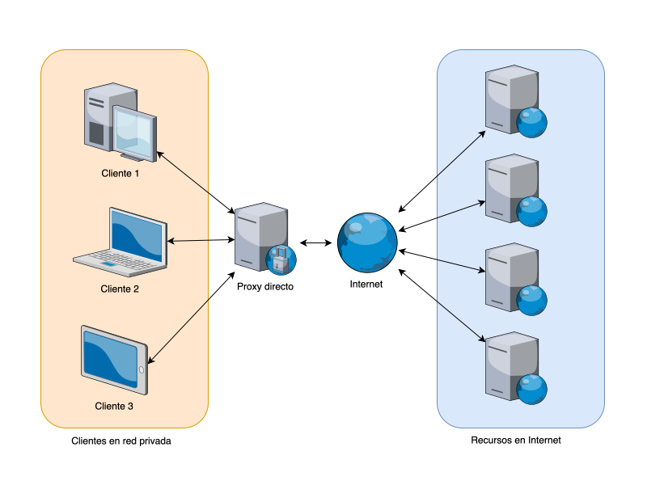
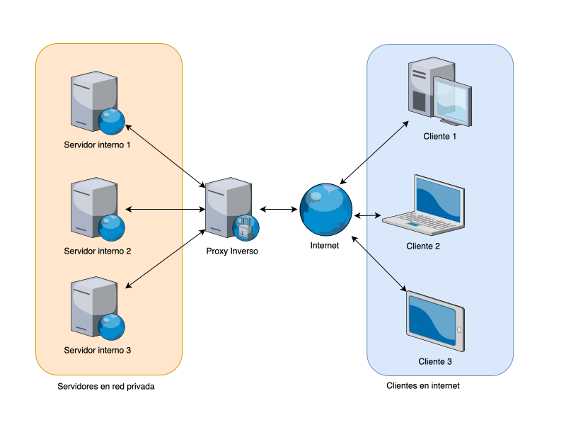
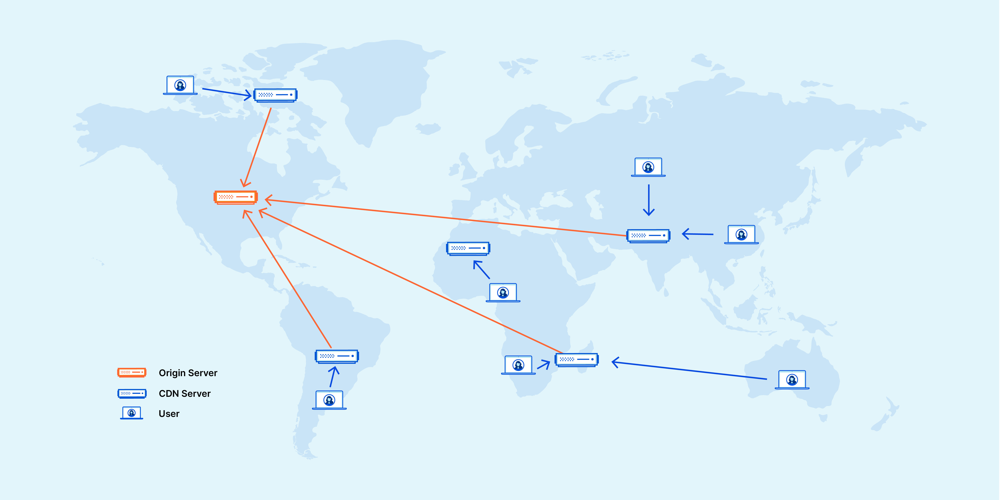

<!-- .slide: data-background="#2C3E50" -->
# Proxies, WAF y seguridad en aplicaciones

---

### Índice

- Proxy directo
- Proxy inverso
- WAF (Web Application Firewall)
- CDN (Content Distribution Network)
- Buenas prácticas en desarrollo aplicaciones

---

## Proxy directo (Forward Proxy)

--

### Proxy directo (Forward Proxy)

- **Definición**: Es un servidor que actúa como intermediario entre los clientes internos (p. ej., navegadores de los usuarios de una organización) y los servidores externos de Internet.
- Trabaja en capa de **aplicación**.

--

### Proxy directo (Forward Proxy)

<!-- .element width="70%" -->

--

### **Funciones principales**:

- **Filtrado de contenido**: Bloqueo de sitios o contenidos maliciosos o no autorizados (control parental, políticas de empresa, etc.).
- **Caché**: Almacena de forma temporal contenido (imágenes, páginas web) para acelerar el acceso y reducir el ancho de banda.   
- **Registro y auditoría**: Puede almacenar logs de navegación para auditorías y revisiones posteriores.
- **Anonimización**: En ocasiones se utiliza para ocultar la dirección IP real de los clientes.

--

### **Ventajas en seguridad**

- Permite una política de acceso centralizada (listados blancos y negros).
- Ayuda a detectar tráfico anómalo o infecciones en dispositivos internos que intenten comunicarse con direcciones maliciosas.

---

### Configuración del Proxy en el cliente

- Sistema operativo
	- [Config. proxy en windows](https://support.microsoft.com/es-es/windows/usar-un-servidor-proxy-en-windows-03096c53-0554-4ffe-b6ab-8b1deee8dae1#:~:text=Selecciona%20el%20bot%C3%B3n%20Inicio%20y,activa%20Detectar%20autom%C3%A1ticamente%20la%20configuraci%C3%B3n.)
- Navegador Web
	- [https://support.mozilla.org/en-US/kb/connection-settings-firefox](https://support.mozilla.org/en-US/kb/connection-settings-firefox)
- Proxy **transparente**
	- El cliente usa el proxy sin una configuración específica. La red obliga a usar el proxy.

---

## Proxies directos de código abierto

--

### Squid

- **Squid** es quizá el proxy directo más conocido, especialmente en entornos de caché (HTTP/HTTPS/FTP).
- Permite filtrar tráfico, almacenar contenido en caché y gestionar reglas de acceso.
- Muy utilizado en redes de empresas e instituciones educativas.

- [Página oficial](http://www.squid-cache.org/)
- [Repositorio Git](https://github.com/squid-cache/squid)

--

#### Apache Traffic Server

- **Apache Traffic Server** es una solución de alto rendimiento para almacenamiento en caché y proxy.
- Diseñado para entornos de gran volumen de tráfico (proveedores de contenidos, grandes redes).
- Soporta extensiones y plugins que amplían sus funcionalidades.

- [Página oficial](https://trafficserver.apache.org/)
- [Repositorio GitHub](https://github.com/apache/trafficserver)

---

###  Proxy inverso (Reverse Proxy)

--

###  Proxy inverso (Reverse Proxy)

- **Definición**: Actúa como punto de entrada para las solicitudes externas dirigidas a servidores internos (p. ej., aplicaciones web, servicios en la DMZ).

--

###  Proxy inverso (Reverse Proxy)

<!-- .element width="70%" -->

--

### Funciones principales

- **Balanceo de carga**: Distribuye las peticiones entre varios servidores para optimizar recursos y disponibilidad.
- **Protección de la infraestructura**: Oculta la ubicación y la IP real de los servidores internos, ofreciendo una capa adicional de seguridad.
- **Cifrado/Descifrado SSL/TLS**: Permite descargar la carga criptográfica de los servidores backend (terminación SSL).
- **Filtro de ataques**: Detiene o detecta tráfico malicioso antes de que llegue a los servidores finales (por ejemplo, con reglas de seguridad).

--

### Ventajas en seguridad

- Ayuda a contener ataques de denegación de servicio (**DDoS**) al gestionar conexiones entrantes y salientes.
- Facilita la aplicación de **políticas de filtrado** y la **monitorización** del tráfico dirigido a los servidores internos.

---

## Proxies inversos de código abierto

--

### Proxies inversos de código abierto

1. [**Nginx**](https://nginx.org/)    
    - Es uno de los servidores web y proxies más **populares**.
    - Destaca por su **eficiencia** en el manejo de múltiples conexiones concurrentes y su gran capacidad de caché.
    - Muy utilizado para balanceo de carga y terminación SSL/TLS.
2. [**HAProxy**](https://www.haproxy.org/)    
    - Se especializa en balanceo de carga y alta disponibilidad.
    - Muy **eficiente** en términos de rendimiento y **escalabilidad**, incluso con miles de conexiones simultáneas.
    - Aunque tradicionalmente se ha visto más como un _load balancer_, también opera como proxy inverso.

--

### Proxies inversos de código abierto (Contenedores)

1. [**Traefik**](https://traefik.io/traefik/)    
    - Pensado para entornos de contenedores (Docker, Kubernetes, etc.).
    - Se integra con orquestadores para descubrir servicios y aplicar reglas de enrutamiento.
4. [**Envoy**](https://www.envoyproxy.io/)    
    - Inicialmente creado por Lyft, se ha popularizado para el uso en **service meshes** (por ejemplo, Istio).
    - Altamente configurable y extensible, con énfasis en observabilidad y métricas.

---

## WAF (Web Application Firewall)

--

### WAF (Web Application Firewall)

Un **WAF** se ubica normalmente en el perímetro de la aplicación o en un proxy inverso, **analizando y filtrando** el tráfico a nivel de aplicación (capa 7 del modelo OSI).

--

- **Detección y bloqueo de ataques web comunes**
    - **Inyección SQL (SQLi)**: El WAF identifica patrones sospechosos en las consultas a la base de datos (p. ej., `UNION SELECT`, `OR 1=1`, etc.).
    - **Cross-Site Scripting (XSS)**: Previene la inyección de scripts maliciosos en las páginas servidas al usuario.
    - **Inyección de comandos y otros ataques de aplicación**: Valida encabezados y parámetros, bloqueando entradas no deseadas.
- **Reglas y firmas**
    - Utiliza **bases de firmas** actualizadas (similar a los IDS/IPS).
    - Puede emplear **análisis heurístico** y modelos de aprendizaje para detectar anomalías.

--

- **Limitaciones y posibles bypasses**
    - Un WAF mal configurado o desactualizado puede ser vulnerado con técnicas avanzadas (p. ej., evasión de firmas mediante codificación).
    - Requiere un mantenimiento continuo y un ajuste regular de las reglas para evitar **falsos positivos** y omisiones.
- **Integración con otras tecnologías**
    - Se suele integrar con **SIEM**, **firewalls**, sistemas de monitoreo y **CDNs** (p. ej. Cloudflare con WAF incorporado).

---

### WAFs de de código abierto

--

#### 1. [ModSecurity](https://modsecurity.org/)

- **Descripción**: Es, probablemente, el WAF de código abierto más conocido y utilizado. Funciona como un módulo que puede integrarse con servidores web como Apache, Nginx o IIS.
- **Características destacadas**:
    - Soporta reglas personalizadas y el conjunto de reglas de OWASP (OWASP ModSecurity Core Rule Set).
    - Ofrece gran capacidad de inspección, registro y análisis del tráfico HTTP.
    - Dispone de una comunidad activa que contribuye con reglas y configuraciones específicas.

--
#### 4. [Coraza WAF](https://coraza.io/)

- **Descripción**: Coraza es un WAF más reciente, escrito en **Go**, y compatible con las reglas de ModSecurity.
- **Características destacadas**:
    - Cuenta con una arquitectura moderna y un rendimiento bastante alto debido a su implementación en Go.
    - Soporta el OWASP Core Rule Set (CRS), lo que facilita su adopción para quienes ya están familiarizados con ModSecurity.
    - Se integra en diversos entornos y ofrece una API que permite extender y personalizar su comportamiento.

---

## CDN (Content Delivery Network)

---

### CDN (Content Delivery Network)

Un **CDN** (Red de Entrega de Contenido) consiste en una red distribuida de servidores que **almacenan y entregan** contenido estático o dinámico a los usuarios de forma más rápida y eficiente. 

**Complementa** el trabajo de los proxies inversos y los WAF:
- Al acercar el contenido a los usuarios
- Disminuir la carga en el servidor de origen 
- Añadir una nueva capa de protección frente a ciberataques

--

### CDN (Content Delivery Network)

<!-- .element width="80%" -->

--

### CDN: Beneficios principales

1. **Reducción de latencia**    
    - Múltiples ubicaciones alrededor del mundo: los usuarios se conectan a un nodo cercano.
2. **Alivio de carga en el servidor de origen**    
    - Actúa como caché del contenido estático (imágenes, archivos CSS/JS, vídeos, etc.), evitando que el servidor principal se sature.
3. **Mayor disponibilidad**    
    - En caso de que un nodo CDN falle, el tráfico se redirige a otro nodo. 

--

### CDN: Beneficios principales

1. **Mitigación de ataques DDoS**    
    - Muchos proveedores de CDN integran sistemas de protección y filtros, bloqueando trafico malicioso antes de que llegue a la infraestructura de origen.
2. **Compatibilidad con WAF y SSL/TLS**    
    - Muchos CDN (ej. Cloudflare, Akamai) incluyen servicios de **WAF**, terminación SSL/TLS y otras funcionalidades de seguridad en la misma plataforma.

--

### CDN: Relación con proxy inverso

El CDN ctúa de forma muy similar a un **proxy inverso** global: 

- Recibe las peticiones en “sus” servidores distribuidos y, si el contenido no está en caché o está desactualizado, reenvía esa petición a la infraestructura de origen.
- Desde la perspectiva del servidor final, el tráfico procede del CDN (similar a un proxy inverso); desde la perspectiva del usuario, el servicio responde más rápido porque se conecta al nodo CDN más cercano.

---

### Proveedores y herramientas populares

- **Cloudflare**: Ofrece CDN, WAF, proxy inverso y otras soluciones de seguridad.
- **Akamai**: Uno de los pioneros en servicios de CDN a gran escala, usado por grandes compañías de medios.
- **Amazon CloudFront**: CDN integrado en la plataforma AWS.
- **Fastly**: Famoso por su infraestructura de alta velocidad y soporte en tiempo real para cambios de configuración.

---

### Mejores prácticas con CDN

1. **Configuración óptima de caché**    
    - Definir correctamente los encabezados de caché (Cache-Control, Expires), para que los nodos del CDN sirvan el contenido el tiempo adecuado.
    - No sobrecargar con TTLs excesivamente largos que sirvan contenido anticuado.
2. **Uso combinado con proxy inverso y WAF**    
    - Colocar el CDN como capa frontal, seguido de un proxy inverso propio o un balanceador de carga, y por último el WAF y los servidores internos.
    - Asegurar que la configuración DNS y los certificados SSL estén debidamente gestionados.

--

### Mejores prácticas con CDN

3. **Optimización de recursos**    
    - Minimizar y comprimir CSS, JavaScript y otros archivos.
    - Garantizar que las imágenes tengan el formato y resolución adecuados para mejorar la velocidad de descarga.
4. **Supervisión continua**    
    - Monitorizar el rendimiento de los nodos CDN y las tasas de aciertos en la caché (cache hit ratio).
    - Ajustar la configuración según la localización de tus usuarios y el tipo de contenido que sirvas.

---

## Buenas prácticas en desarrollo aplicaciones

--

### Buenas prácticas en desarrollo aplicaciones

La seguridad no depende solo de los proxies o WAF; **las aplicaciones deben estar “fortificadas”** desde su concepción. Algunas recomendaciones clave:

--

### Buenas prácticas en desarrollo aplicaciones

1. **Certificados SSL/TLS y configuración de HTTPS**    
    - Uso de certificados válidos emitidos por CA de confianza.
    - Configuración de **TLS** fuerte (deshabilitar protocolos obsoletos como SSLv3 y TLS 1.0).
    - Implementación de **HSTS (HTTP Strict Transport Security)** para forzar el uso de HTTPS.
2. **Gestión de contraseñas y autenticación**    
    - Almacenar contraseñas con **hashing y salt** (ej. bcrypt, Argon2).
    - Autenticación multifactor (MFA) cuando sea posible, sobre todo en áreas críticas.
    - Políticas de bloqueo tras varios intentos fallidos.

--

### Buenas prácticas en desarrollo aplicaciones

3. **Validación de entradas y outputs**    
    - Saneamiento de datos y validaciones del lado del servidor (no confiar solo en validaciones de JavaScript).
    - Evitar mostrar mensajes de error detallados que ayuden a un atacante a comprender la estructura interna de la aplicación.
4. **Integración con SIEM**    
    - Registro centralizado de eventos relevantes (intentos de inicio de sesión fallidos, cambios de configuración, etc.).
    - Correlación de esos eventos con los de otros componentes de seguridad (firewall, IDS, WAF).
    - Alertas y notificaciones automatizadas ante patrones sospechosos.

---

## Open Worldwide Application Security Project (OWASP)

--

OWASP

- [https://owasp.org/](https://owasp.org/)

**OWASP** (Open Web Application Security Project) es una **organización sin ánimo de lucro** que se dedica a mejorar la seguridad del software. Fundada en 2001, OWASP es ampliamente conocida por proporcionar **herramientas, documentación, estándares y recursos educativos gratuitos** para ayudar a desarrolladores, ingenieros de seguridad y empresas a identificar y mitigar vulnerabilidades en aplicaciones web.

--

### Principales objetivos de OWASP:

1. **Concienciación:** Promover la importancia de la seguridad en el desarrollo de software.
2. **Recursos gratuitos:** Ofrecer guías, herramientas y proyectos abiertos accesibles a cualquier persona interesada en mejorar la seguridad de sus aplicaciones.
3. **Colaboración:** Fomentar la participación de la comunidad global de profesionales de la seguridad.

--

### Proyectos destacados de OWASP:

- [**OWASP Top 10:**](https://owasp.org/www-project-top-ten/) Lista de las 10 principales vulnerabilidades de seguridad en aplicaciones web. Es uno de los recursos más utilizados para identificar y mitigar riesgos.
- **[OWASP ASVS](https://owasp.org/www-project-application-security-verification-standard/) (Application Security Verification Standard):** Un marco para verificar los controles de seguridad en las aplicaciones.
- [**Cheat Sheets:** ](https://owasp.org/www-project-cheat-sheets/)Guías rápidas y prácticas para implementar medidas de seguridad específicas.

