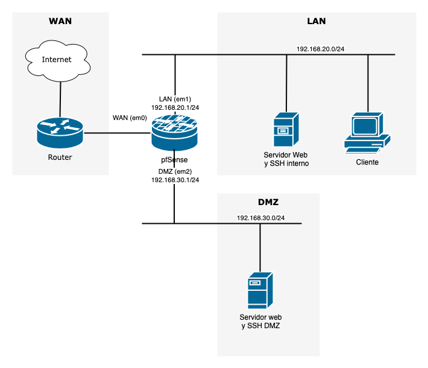
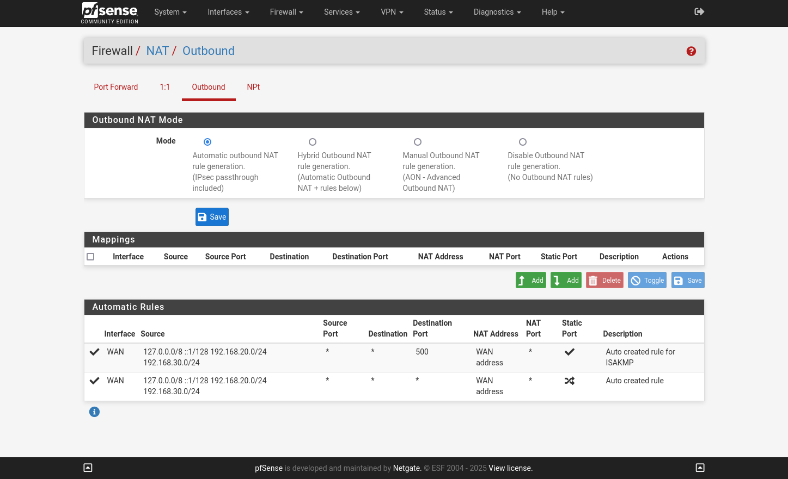
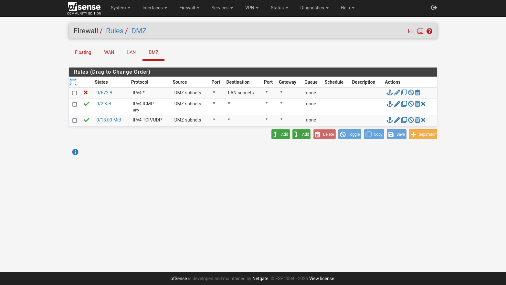
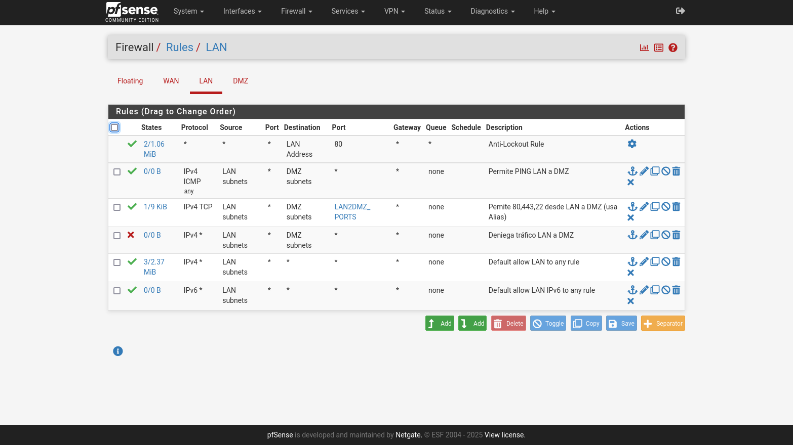
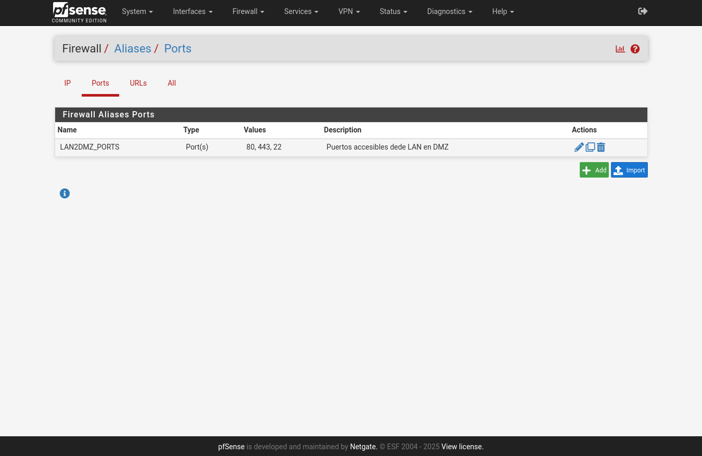
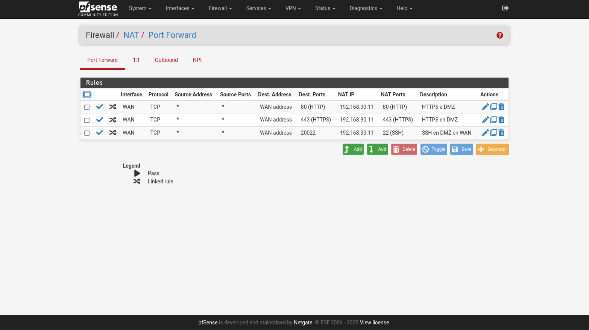

# Instalación y configuración de un cortafuegos perimetral

## 1. Introducción

En esta práctica vamos a montar un escenario de firewall con NAT y una DMZ (zona desmilitarizada) usando **pfSense**. **La idea principal** es aislar uno o más servidores en una red dedicada (DMZ), mientras permitimos que los usuarios internos (LAN) accedan a Internet de manera segura por medio del firewall y la traducción de direcciones de red (NAT).

{:style="width: 50%;" class="center"}

### Netgate

[Netgate](https://www.netgate.com/) es la empresa detrás del desarrollo y soporte de pfSense, conocida por ofrecer soluciones de seguridad de red de alto rendimiento y a un costo accesible. Ofrecen:

- **[Hardware dedicado](https://www.netgate.com/pfsense-plus-software/how-to-buy#appliances):** Dispositivos diseñados y optimizados para ejecutar pfSense, como la serie Netgate 1100, 4100 o 6100.
- **[Soporte comercial](https://www.netgate.com/support):** Servicios de soporte técnico y consultoría para clientes empresariales.
- **[pfSense Plus](https://www.netgate.com/pfsense-plus-software):** Una versión comercial de pfSense con características adicionales enfocadas en empresas.
- **Desarrollo continuo:** Netgate mantiene y mejora pfSense, asegurando actualizaciones regulares y soporte a la comunidad.

### pfSense

[**pfSense**](https://www.pfsense.org/) es un sistema operativo de código abierto basado en **FreeBSD** diseñado para funcionar como un firewall y router. Es ampliamente reconocido por su robustez, flexibilidad y capacidad de personalización, y se utiliza tanto en entornos empresariales como domésticos. Sus características clave incluyen:

- **Firewall avanzado:** Basado en reglas con inspección de estado (stateful).
- **VPN integrado:** Compatibilidad con IPsec, OpenVPN y WireGuard.
- **Balanceo de carga y conmutación por error.**
- **Soporte de VLAN y NAT.**
- **Funciones de seguridad adicionales:** IDS/IPS con Snort o Suricata.
- **Ampliación mediante paquetes:** Squid (proxy), pfBlockerNG (bloqueo de publicidad y control de contenido), etc.

## 2. Objetivos de la práctica

Usaremos **VirtualBox** para simular el escenario de la red de una organización con un cortafuegos que disponga de tres zonas: interna (LAN), externa (WAN) y DMZ. Esta configuración es habitual en pequeñas organizaciones, aunque existen entornos más complejos con varias capas de cortafuegos y más zonas.

El esquema propuesto es el siguiente:

{:style="width: 90%;" class="center"}

1. **Configurar pfSense** como firewall principal en la red.
2. **Habilitar NAT** para que las conexiones salientes desde LAN y DMZ a Internet se realicen correctamente.
3. **Crear una DMZ** para alojar uno o varios servicios (servidores web, correo, etc.) separada de la LAN.
4. **Establecer reglas de firewall** que permitan (o restrinjan) tráfico entre LAN, DMZ e Internet.
    - **Directiva 1**: Desde la red interna (LAN) a la DMZ se permite ICMP, HTTP, HTTPS y SSH. No se permite ningún otro servicio.
    - **Directiva 2**: Desde Internet al servidor de la DMZ debe permitirse tráfico entrante a HTTP, HTTPS y SSH, aunque **el SSH** se publicará externamente en el **puerto 20022** (redirección de puertos).
    - Directiva3: Desde la DMZ no se debe poder acceder a la LAN,

Durante la práctica, se debe **realizar una memoria** en **PDF** para documentar todo el proceso, se recomienda documentar con **capturas** y **explicaciones**:

1. **Configuración de VirtualBox** (adaptadores de red).
2. **Instalación de pfSense** y asignación de interfaces (capturas de la consola o del asistente web).
3. **Configuración WAN, LAN y DMZ** (capturas de las pantallas con IPs asignadas).
4. **Configuraciones de NAT** (reglas de Port Forward y NAT Outbound).
5. **Reglas de Firewall** en WAN, LAN y DMZ (capturas y explicaciones de cada regla).
6. **Pruebas de conectividad** (ping, acceso web, SSH desde WAN y LAN).
7. **Conclusiones**: Reflexión sobre el funcionamiento, posibles mejoras, buenas prácticas de seguridad (bloqueo de puertos no usados, hardening, etc.).

El informe final puede ser en formato PDF con capturas de pantalla y comentarios claros. Asegúrate de subirlo según las instrucciones de tu profesor o de la plataforma de e-learning correspondiente.

## 3. Requisitos y Preparación

### 3.1 Requisitos de VirtualBox

- **VirtualBox** instalado en el equipo anfitrión (host).
- **Imagen ISO de pfSense** descargada de la web oficial ([https://www.pfsense.org/download/](https://www.pfsense.org/download/)).

### 3.2 Configuración de la VM de pfSense

**Configuración de VM y requisitos mínimos** en VirtualBox:

- **Sistema operativo**: BSD (FreeBSD 64-bit).
- **RAM**: mínimo 512 MB (recomendado 1024 MB o más).
- **Disco duro (HDD)**: mínimo 20 GB.
- **3 Interfaces de red** en la VM de pfSense.

**Adaptadores de red** en VirtualBox:

1. **Adaptador 1**: Modo Puente (Bridge) o NAT (para simular la WAN).
    - Obtendrá IP por DHCP si eliges NAT o Bridge.
2. **Adaptador 2**: `Sólo-anfitrión` (Host-only) para la **LAN**.
3. **Adaptador 3**: `Red interna` con nombre DMZ (por ejemplo “DMZ”) para la **DMZ**.

### 3.3 Máquinas Clientes/Servidores

- **Máquinas Linux** (servidores) en la DMZ con servicios como Apache (HTTP/S) y SSH.
- **Máquinas Linux/Windows** (clientes) en la LAN para probar conectividad.
- Asegurarse de configurar el firewall local de los servidores para **permitir** las conexiones en los puertos necesarios (80, 443 y 22).
- También **se recomienda asignar IP estática a los servidores en la DMZ** para un mayor control (ej. 192.168.30.2, 192.168.30.3, etc.).

## 4. Instalación y Configuración inicial de pfSense

1. **Instalar pfSense** desde la ISO en la VM:    
    - Seleccionar los valores por defecto durante la instalación.
    - Asignar:
        - **WAN** a `em0` (o la que corresponda en tu caso).
        - **LAN** a `em1`.
    - Seleccionar instalar la versión **CE** (Community Edition)
    - Al finalizar, **reiniciar** la VM.
2. **Acceso a la interfaz web de pfSense**    
    - Por defecto, pfSense asigna la IP 192.168.1.1 a la LAN y bloquea el acceso desde la WAN.
    - Desde tu **máquina cliente en LAN**, abrir un navegador y acceder a `https://192.168.20.1` (o la IP que configuraste).
    - Credenciales por defecto:
        - Usuario: `admin`
        - Contraseña: `pfsense`
    - **Cambiarlas inmediatamente por seguridad.**
    - Si tienes dificultades conectando desde el host, intenta conectar desde una máquina virtual conectada a la red LAN y con la configuración de red adecuada.
3. **Asignación de interfaces** (al iniciar pfSense por primera vez):    
    - pfSense detectará las tarjetas de red como `em0`, `em1`, `em2`, etc.
    - Asignar:
        - **WAN** a `em0` (o la que corresponda en tu caso).
        - **LAN** a `em1`.
        - **OPT1** (renombrada a “DMZ”) a `em2`.
4. **Configuración de la IP WAN**    
    - Si la WAN está en modo DHCP (p.ej. VirtualBox NAT/Bridge), pfSense obtendrá IP automáticamente.
    - Si es una IP estática, configurar manualmente en `Interfaces > WAN` (IP, máscara, gateway, DNS, etc.).
5. **Configuración de la IP LAN**    
    - En `Interfaces > LAN`, asignar una IP del tipo 192.168.20.1/24.
    - Habilitar (opcional) el **servidor DHCP** para la LAN, o asignar IPs fijas a los clientes.
6. **Configuración de la IP DMZ**    
    - Renombrar la interfaz `OPT1` a “DMZ” para mayor claridad.
    - En `Interfaces > (OPT1 o DMZ)`, habilitar la interfaz y asignar una IP distinta a la de LAN. Ejemplo: 192.168.30.1/24.
    - (Opcional) Habilitar servidor DHCP en DMZ o asignar IP fija a los servidores en DMZ. En entornos reales, **IP fija** es más común para servidores.
7. **Permitir IPs privadas en WAN** (si tu WAN usa direcciones de red privada)    
    - Ve a **Interfaces > WAN**.
    - Localiza la opción **Block private networks and loopback addresses** y **desmárcala** si la WAN está recibiendo una IP privada (10.x, 172.16.x, 192.168.x...).
    - Guardar y aplicar cambios.

### Posibles Problemas pfSense virtualizado

#### Las máquinas virtuales no consiguen conectarse a Internet

Dependiendo de tu hardware es posible que pfSense no funcione bien, no siendo capaz de enviar tráfico desde las máquinas virtuales hacia la WAN. Si esto te sucede, puedes solucionarno desde `System > Advanced > Networking`y marca la casilla **Disable hardware checksum offload**. Esto requerirá un reinicio de pfSense para tener efecto. Más información [aquí](https://docs.netgate.com/pfsense/en/latest/virtualization/virtio.html).

## 5. Configuración de NAT y Reglas de Firewall

- Las reglas en pfSense se ejecutan de arriba hacia abajo, así que el orden es muy importante. Se pueden reordenar arrastrando desde la interfaz web.
- Recuerda que cada vez que añades o haces cambios a las reglas no se aplicarán hasta que pulses el botón "Apply changes" que aparecerá en un banner en la parte superior tras realizar los cambios. Esto te permite realizar los cambios por partes y aplicarlos solamente cuando todos los cambios necesarios han sido realizados.

### 5.0 Configurar DNS de pfSense

Para que pfSense resuelva nombres DNS debes indicar qué servidores serán consultados.

1. Accede a la interfaz web de pfSense y dirígete a `System > General Setup`.
2. En la sección **DNS Server Settings**, especifica las direcciones IP de los servidores DNS deseados (por ejemplo, los proporcionados por tu ISP o servicios públicos como Cloudflare o Google).
- Guarda los cambios haciendo clic en `Save`.

### 5.1 Habilitar y verificar NAT saliente

1. **NAT automático**: Por defecto, pfSense configura NAT saliente automático (Outbound NAT), lo que permite que las redes LAN y DMZ salgan a Internet usando la IP de la WAN.  
2. Para verificarlo, ve a **Firewall > NAT > Outbound** y revisa que aparezcan reglas para las subredes LAN (p.ej. 192.168.20.0/24) y DMZ (192.168.30.0/24).  
3. Prueba con un cliente en **LAN** y otro en **DMZ** haciendo un **ping** a un dominio (ej. `ping www.google.com`) para comprobar que sale a Internet y que funcionan los DNS.

### 5.2 Reglas de Firewall en la LAN

- Por defecto, pfSense crea una regla en **Firewall > Rules > LAN** que **permite** todo el tráfico saliente (desde LAN a cualquier destino).  
- Para la práctica, normalmente se deja así para simplificar, aunque en producción se recomienda detallar reglas más específicas.  

En la siguiente captura se muestran las reglas NAT generadas automáticamente en pfSense:

{:style="width: 90%;" class="center"}
### 5.3 Reglas de Firewall en la DMZ

1. Ir a **Firewall > Rules** y seleccionar la pestaña **DMZ**.  
2. Para permitir que la DMZ tenga acceso a Internet (opcional, si tu política lo autoriza), añadir una regla “Allow DMZ net to any” (o solo a puertos específicos).  
3. **Cumplir Directiva 3**: “Desde la DMZ no se debe poder acceder a la LAN”.  
   - Por defecto, si creas una regla genérica “DMZ net to any”, eso **incluye** la LAN, lo cual **rompería** la directiva.  
   - Para **bloquear** explícitamente el tráfico de la DMZ hacia la LAN, crea **una regla de bloqueo** en la DMZ con destino “LAN net”. Por ejemplo:  
     - **Action**: Block  
     - **Interface**: DMZ  
     - **Protocol**: Any (o TCP/UDP/ICMP si quieres ser más granular)  
     - **Source**: DMZ net  
     - **Destination**: LAN net  
     - **Description**: “Bloquear tráfico DMZ -> LAN (Directiva 3)”  
   - Esta regla de **Block** debe estar **por encima** de cualquier otra regla de tipo “Allow DMZ net to any” para que se aplique primero.  

La siguiente captura muestra las reglas necesarias para habilitar el tráfico ICMP y TCP/IP saliente de la DMZ, también hay una regla que impide que la DMZ llegue a la LAN. Esta regla debe estar la primera para que no se lleguen a ejecutar las reglas posteriores.
{:style="width: 90%;" class="center"}

### 5.4 Directiva 1: LAN -> DMZ

En la pestaña **LAN** (Firewall > Rules > LAN), se debe permitir **solo** ICMP, HTTP, HTTPS y SSH desde la LAN hacia la DMZ (y nada más).  
1. En lugar de la regla por defecto “Allow any”, crearemos varias reglas puntuales:  
   - **Regla 1**: Permitir LAN net -> DMZ net, **Protocol**: ICMP.  
   - **Regla 2**: Permitir LAN net -> DMZ net, **Protocol**: TCP, **Ports**: 80 (HTTP), 443 (HTTPS), 22 (SSH).  Considera crear un **Alias** para estos puertos.
2. Para que no se permita **ningún otro servicio** desde LAN a DMZ, ponemos luego una regla de **Block** (o Deny) de “LAN net” a “DMZ net” **por encima** o **debajo** de dichas reglas, dependiendo de cómo estructures las prioridades.  
3. Recuerda: las reglas en pfSense se evalúan de **arriba hacia abajo**. 

La siguiente captura muestra las reglas añadidas a la LAN. La primera es una regla automática para permitir el acceso a la interfaz web, las dos últimas las autoconfigura pfSense durante la instalación. El resto de reglas limita el acceso desde la LAN a la DMZ, permitiendo solamente el tráfico ICP y el tráfico a los puertos TCP 80, 443 y 22. Para poder incluir los tres puertos en una misma regla se ha definido un Alias de puertos.
{:style="width: 90%;" class="center"}

A continuación se muestra el alias de puertos definido:

{:style="width: 90%;" class="center"}
### 5.5 Directiva 2: WAN -> DMZ (Port Forward / Redirección de Puertos)

Para acceder al servidor en DMZ desde Internet, configuramos las **reglas de Port Forward** en **Firewall > NAT > Port Forward**:  
1. **Puerto 80 (HTTP)** -> Servidor DMZ (p.ej. 192.168.30.2:80).  
2. **Puerto 443 (HTTPS)** -> Servidor DMZ (p.ej. 192.168.30.2:443).  
3. **Puerto 20022** (SSH externo) -> Servidor DMZ (192.168.30.2:22).  

pfSense, al **crear** cada port forward, normalmente crea también la regla en **Firewall > Rules > WAN** que permite ese tráfico. Verifica que:  
- **Destination** sea la IP de la WAN (o “WAN address”).  
- **Redirect target IP** sea la IP interna del servidor DMZ (ej. 192.168.30.2) y el puerto final (22, 80, 443).  

Asegúrate de que el servidor en DMZ tenga abiertos los puertos 22, 80 y 443 en su firewall local.

{:style="width: 90%;" class="center"}

## 6. Comprobación y Pruebas

#### 6.0 Configuración de red de  equipos

* Usará DHCP o configuración estática dependiendo de cómo hayas configurado pfSense. (Se recomienda DHCP en la LAN e IPs estáticas en la DMZ)
* En caso de configuraciones de IP estáticas:
	- gateway: ip de pfSense de la red a la que están conectados
		- LAN: 192.168.20.1
		- DMZ: 192.168.30.1
	- DNS: ip de pfSense de la red a la que están conectados

### 6.1 Pruebas desde LAN

1. **Ping** desde una máquina en LAN a la IP de pfSense LAN (192.168.20.1). Debe responder.  
2. **Ping** desde LAN a la IP del pfSense en DMZ (192.168.30.1) y a la IP del servidor en DMZ (192.168.30.2). Deben responder (ICMP permitido por Directiva 1).  
3. **HTTP/HTTPS/SSH**: Desde LAN, intenta conectarte al servidor en DMZ (p.ej. `http://192.168.30.2`, `ssh 192.168.30.2`). Debe funcionar según Directiva 1.  
4. Verificar que **no** puedas usar otros servicios (por ejemplo, `telnet` a un puerto no autorizado), para confirmar que solo ICMP, HTTP, HTTPS y SSH están permitidos.

### 6.2 Pruebas desde DMZ (cumplimiento de Directiva 3)

1. **Ping** desde el servidor en DMZ a la IP de pfSense DMZ (192.168.30.1). Debe responder (si la DMZ->pfSense DMZ net está permitida).  
2. **Ping** o acceso a Internet (8.8.8.8, www.google.com), si creaste una regla “Allow DMZ -> any”.  
3. **Intentar** hacer ping o acceder a la LAN (p.ej. `ping 192.168.20.2` o abrir http://192.168.20.x).  
   - **Resultado esperado**: Bloqueo, es decir, **no** debe responder.  
   - Revisar los **logs** de pfSense (Status > System Logs > Firewall) para ver la regla de bloqueo aplicada.  

### 6.3 Pruebas desde la WAN (Internet)

1. **Obtener la IP pública/externa** (WAN) de pfSense (por DHCP o estática).  
2. Desde **otra red externa** (o simulada con otra máquina en VirtualBox en modo NAT/bridge), probar:  
   - `http://(IP_WAN)`, `https://(IP_WAN)`, `ssh -p 20022 (IP_WAN)`.  
   - Verificar que se redirija al servidor DMZ y funcione.  
3. Revisar **logs** en pfSense (Status > System Logs) para confirmar que el tráfico es permitido y hacia qué IP interna se dirige.

## 7. Recomendaciones Finales y Buenas Prácticas

1. **Cambiar credenciales por defecto** de pfSense y de los servidores.  
2. **Mantener pfSense actualizado** con los últimos parches de seguridad.  
3. **Respaldar** la configuración de pfSense (`Backup & Restore`) con regularidad.  
4. **Registrar logs externamente** (Syslog) para seguimiento y auditoría.  
5. **Limitar accesos administrativos**:
   - Desactivar acceso web desde la WAN (salvo que sea indispensable, usando HTTPS y credenciales seguras).  
   - Usar VPN para la administración remota.  
6. **Monitorear** con paquetes adicionales como Snort/Suricata (IDS/IPS) y pfBlockerNG para filtrar contenido y bloquear IPs maliciosas.

## 8.  (Opcional) Aislar la interfaz gráfica a una red de administración en pfSense

Mover la interfaz gráfica de **pfSense** a una red de administración dedicada es una **buena práctica en instalaciones profesionales**, ya que mejora la seguridad y facilita la gestión de la infraestructura.

#### **Ventajas de mover la interfaz gráfica a una red de administración**

1. **Seguridad mejorada**:    
    - Limita el acceso a la interfaz web de pfSense únicamente a administradores autorizados.
    - Reduce el riesgo de ataques desde redes de usuarios o dispositivos no confiables.
2. **Segmentación de la red**:    
    - Mantener la administración separada de las redes de producción minimiza posibles interferencias.
    - Facilita el monitoreo y el control de accesos.
3. **Acceso controlado**:    
    - Puedes configurar reglas estrictas de firewall para permitir el acceso solo desde dispositivos específicos o subredes administrativas.

Aquí tienes los pasos para hacerlo:

#### 1. **Crear una red de administración dedicada**:

- Asigna una interfaz física o VLAN en pfSense para la red de administración.
- Ve a **Interfaces > Assignments** y configura una nueva interfaz (por ejemplo, **ADMIN**).
- Asigna una dirección IP fija a esta interfaz (por ejemplo, 192.168.100.1/24).
#### 2. **Ajustar las reglas del firewall**:

- Ve a **Firewall > Rules** en la nueva interfaz de administración.
- Crea una regla para permitir acceso HTTP/HTTPS (puertos 80 y 443 por defecto) desde las IPs o subredes de administradores autorizados.
- Bloquea el acceso desde otras redes o direcciones IP no autorizadas.

#### 3. **Deshabilitar acceso desde otras interfaces**:

- Revisa las reglas de las interfaces **LAN** y **WAN** para asegurarte de que no permitan acceso al puerto de la interfaz web.
- 
#### 4. **Configurar acceso SSH (opcional)**:

- Si necesitas administración remota, configura el acceso SSH también en la interfaz de administración.
- Ve a **System > Advanced**, pestaña **Admin Access**. Y habilita el SSH.
- Asegúrate de usar claves SSH en lugar de contraseñas para mayor seguridad. 

## 9 (Opcional) Usar pfblockerNG para evitar amenazas

**pfBlockerNG** es una potente herramienta de filtrado y seguridad que se integra con **pfSense**, diseñada para proporcionar un control avanzado sobre el tráfico de red. Su principal función es bloquear contenido no deseado, como dominios maliciosos, publicidad, rastreadores y regiones geográficas específicas, mejorando la privacidad, seguridad y rendimiento de la red.

Con pfBlockerNG, los administradores pueden implementar políticas de red más estrictas, asegurando un entorno protegido frente a amenazas cibernéticas y optimizando la experiencia de navegación de los usuarios.

#### **Características principales de pfBlockerNG**

1. **Filtrado de dominios**:    
    - Permite bloquear dominios maliciosos, phishing o cualquier otro tipo de contenido no deseado utilizando listas negras personalizadas o listas públicas actualizadas automáticamente.
2. **Bloqueo de IPs por región (GeoIP)**:    
    - Ofrece la capacidad de bloquear o permitir tráfico de determinados países o regiones, lo que es útil para limitar accesos no deseados o mitigar ataques específicos.
3. **Eliminación de publicidad y rastreadores**:    
    - Funciona como un bloqueador de anuncios a nivel de red, mejorando la privacidad y la velocidad de navegación al eliminar anuncios y rastreadores.
4. **Compatibilidad con listas personalizadas**:    
    - Permite a los administradores cargar listas negras o listas blancas propias para un control más granular.
5. **Integración con DNSBL** (Domain Name System Block List):    
    - Bloquea la resolución de dominios no deseados, impidiendo que los usuarios accedan a sitios maliciosos o no permitidos.
6. **Gestión centralizada**:    
    - Todo el control se realiza desde la interfaz web de pfSense, permitiendo una configuración sencilla y un monitoreo constante.

Este primer vídeo muestra como instalar y configurar pfblockerNG:

<iframe width="560" height="315" src="https://www.youtube.com/embed/xizAeAqYde4?si=o-VlJpXvda7G4IrY" title="YouTube video player" frameborder="0" allow="accelerometer; autoplay; clipboard-write; encrypted-media; gyroscope; picture-in-picture; web-share" referrerpolicy="strict-origin-when-cross-origin" allowfullscreen></iframe>

Este segundo vídeo profundiza sobre el uso de pfblockerNG para proteger servicios expuestos en Internet.

<iframe width="560" height="315" src="https://www.youtube.com/embed/oNo77CMoxUM?si=sZswkgj3OIpg1aU_" title="YouTube video player" frameborder="0" allow="accelerometer; autoplay; clipboard-write; encrypted-media; gyroscope; picture-in-picture; web-share" referrerpolicy="strict-origin-when-cross-origin" allowfullscreen></iframe>

## Bibliografía

#### Descarga
- [Descarga pfSense web oficial](https://www.pfsense.org/download/)
- [Descarga pfSense desde Dakota State University Mirror](https://repo.ialab.dsu.edu/pfsense/)

#### Documentación
- [Documentación pfSense](https://docs.netgate.com/pfsense/en/latest/)

- [Requisitos hardware pfSense (doc)](https://docs.netgate.com/pfsense/en/latest/hardware/minimum-requirements.html)
- [Requisitos hardware pfSense](https://www.pfsense.org/products/#requirements)

#### Guías
- [Instalación de pfSense en VirtualBox](https://simplificandoredes.com/en/install-pfsense-on-virtualbox/)
- [Configuración de pfSense - RedesZone](https://www.redeszone.net/tutoriales/configuracion-routers/configuracion-router-firewall-pfsense/)

#### Comandos
- [Comandos almalinux](comandos.almalinux.md)
