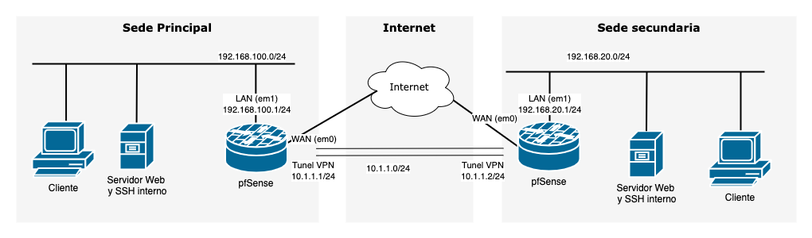

# Configuración de una VPN Site-to-Site con OpenVPN y pfSense

En esta práctica se propone el uso de OpenVPN junto con pfSense para configurar una VLAN site to site entre dos oficinas remotas.

{:style="width: 80%;" class="center"}

### pfSense

pfSense es una plataforma de firewall y router basada en FreeBSD, conocida por su flexibilidad y capacidad para gestionar redes de manera eficiente. Uno de los usos más destacados de pfSense es su capacidad para configurar y administrar redes privadas virtuales (VPN), proporcionando una solución robusta para proteger y optimizar las comunicaciones de una red.

**Características principales del uso de VPN en pfSense**:

1. **Soporte para múltiples protocolos VPN**: pfSense permite implementar protocolos como OpenVPN, IPsec, WireGuard y L2TP/IPsec, adaptándose a las necesidades específicas de seguridad y rendimiento.
    
2. **Seguridad avanzada**: Integra herramientas para la autenticación de usuarios, el cifrado robusto y la gestión granular de políticas, garantizando conexiones seguras y controladas.
    
3. **Gestión centralizada**: A través de su interfaz gráfica, pfSense facilita la configuración y monitorización de las VPN, permitiendo gestionar usuarios remotos o conexiones site-to-site con relativa facilidad.

### OpenVPN 

[**OpenVPN**](https://openvpn.net/) es una solución de software libre ampliamente utilizada para implementar redes privadas virtuales (VPN). Su principal ventaja es su flexibilidad, ya que soporta una gran variedad de configuraciones y se basa en protocolos seguros como SSL/TLS para garantizar la confidencialidad e integridad de los datos. Además, es compatible con múltiples sistemas operativos, lo que lo convierte en una opción versátil tanto para entornos personales como empresariales.

**Usos principales de OpenVPN**:

1. **VPN Site-to-Site**: En este modo, OpenVPN conecta dos redes físicas separadas, como la sede principal de una empresa y una sucursal remota. Esto permite que los dispositivos en ambas redes se comuniquen como si estuvieran en la misma red local, facilitando el acceso a recursos compartidos de forma segura a través de Internet.
    
2. **VPN de Acceso Remoto**: Este enfoque permite a usuarios individuales conectarse de manera segura a una red privada desde cualquier lugar. Es ideal para trabajadores remotos o estudiantes que necesitan acceder a los recursos internos de una organización, como servidores, bases de datos o aplicaciones empresariales, sin comprometer la seguridad.

Gracias a su robustez, escalabilidad y soporte para configuraciones avanzadas, OpenVPN es una solución confiable tanto para pequeñas implementaciones como para grandes redes corporativas.

## Escenario

Tienes dos oficinas remotas que deben compartir recursos de red de manera segura. Una de las oficinas se configurará como el servidor OpenVPN y la otra como el cliente.

## Objetivo

Configurar una VPN Site-to-Site utilizando OpenVPN en dos instancias de pfSense para conectar dos redes separadas y permitir el tráfico entre ellas de manera segura.

- Dos máquinas virtuales con pfSense instaladas.
    
- Dos redes LAN simuladas o reales con rangos diferentes, por ejemplo:
    
    - Red 1: 192.168.100.0/24
        
    - Red 2: 192.168.20.0/24

- En cada red necesitarás uno o varios equipos que actúen como cliente/servidor para comprobar el correcto funcionamiento de la VPN.

- Conectividad entre ambos firewalls pfSense a través de sus interfaces WAN usando una conexión VPN OpenVPN.

## Entregable

Debes entregar una memoria en formato PDF que incluya los siguientes elementos:

1. Informe breve que explique:
    
    - Los pasos realizados.        
    - Problemas encontrados y cómo los solucionaron.        
    - Ventajas de una VPN Site-to-Site en un entorno empresarial.
2. Capturas de pantalla de:
    
    - Configuración del servidor OpenVPN en la sede principal..
        
    - Configuración del cliente OpenVPN en la sede secundaria.
        
    - Pruebas de conectividad entre ambas redes.
        

## Pasos de configuración

Simula el escenario en VirtualBox. 
- Instala dos pfSense.
- Usa una red NAT o  adaptadores puente para las interfaces WAN.
- Usa redes internas para las redes LAN de cada sede.

### 0. Configuración inicial de pfSense

Utiliza el asistente de configuración inicial de pfSense:

- Esteblece los servidores DNS a 1.1.1.1 y 8.8.8.8 (Cloudflare y Google respectivamente)
- En la interfaz WAN asegúrate de haber deshabilitado la opción "Block private networks from entering via WAN". Esto es necesario porque usamos IPs privadas para simular la conexión WAN.
#### Posibles Problemas pfSense virtualizado
##### Las máquinas virtuales no consiguen conectarse a Internet

Dependiendo de tu hardware es posible que pfSense no funcione bien, no siendo capaz de enviar tráfico desde las máquinas virtuales hacia la WAN. Si esto te sucede, puedes solucionarno desde `System > Advanced > Networking`y marca la casilla **Disable hardware checksum offload**. Esto requerirá un reinicio de pfSense para tener efecto. Más información [aquí](https://docs.netgate.com/pfsense/en/latest/virtualization/virtio.html).

### 1. Configuración inicial de las redes

#### Sede Principal (Servidor VPN):

- Configura la red LAN con el rango 192.168.100.0/24.
    
- Configura la interfaz WAN con una red NAT o puente en VirtualBox.
   

#### Sede secundaria (Cliente VPN):

- Configura la red LAN con el rango 192.168.20.0/24.
    
- Configura la interfaz WAN con una red NAT o puente en VirtualBox.
   

### 2. Configurar OpenVPN en la Sede principal (Servidor)

1. Accede al panel de pfSense de la Sede principal.
    
2. Ve a **VPN > OpenVPN** y selecciona la pestaña **Wizards**.
    
3. Sigue los pasos del asistente para crear la configuración del servidor:
    
    - **Type of Server**: `Local User Access`
    - **Certificate Authority (CA):** Añade una descripción y crea una nueva CA.
    - **Server Certificate:** Crea un certificado para el servidor.

	Configuración del servidor OpenVPN:
	- **Server mode**: `Peer to Peer (Shared Key)`. Se muestra un warning avisando de que este método será eliminado en futuras versiones. Más adelante lo cambiaremos a `Peer to Peer (SSL/TLS).
    - **Protocol:** `UDP on IPv4 only`
        
    - **Local Port:** 1194 (puedes elegir otro si es necesario).
        
    - **Tunnel Network:** Asigna una red para la VPN, por ejemplo, 10.1.1.0/24.
        
    - **Local Network:** Agrega la red LAN de la Sede principal (192.168.100.0/24).
        
4. Completa el asistente y guarda la configuración. Asegúrate de marcar las opciones para añadir las reglas que permitan la conexión al puerto expuesto en WAN y el envío de tráfico a través de OpenVPN. O añade las reglas manualmente.
       

### 3. Exportar los archivos de configuración para el cliente

1. Ve a **VPN > OpenVPN > Server**.
    
2. Edita el servidor y copia el texto de "Shared key" que más tarde usarás para configurar el cliente.
    

### 4. Configurar OpenVPN en la Sede secundaria (Cliente)

1. Accede al panel de pfSense de la Sede secundaria.
    
2. Ve a **VPN > OpenVPN > Clients** y agrega un cliente.
    
3. Configura los siguientes parámetros:
    
    - **Server Mode:** Peer to Peer (Shared Key).
        
    - **Server Address:** Ingresa la IP WAN de la Sede principal (Ej: 10.1.1.1).
        
    - **Tunnel Network:** Usa la misma red que configuraste en el servidor (10.1.1.0/24).
        
    - **Remote Network:** Agrega la red LAN de la Sede principal (192.168.100.0/24).
    
	- En "Cryptographic Settings", desmarca "Auto Generate" y pega la "Shared key" que se generó en el servidor.
            
4. Guarda la configuración.
    
5. Añade una regla En Firewall > Rules > OpenVPN que permita que  todo el tráfico pase por el túnel.

Puedes comprobar el estado de la conexión VPN en `Status > OpenVPN`.

### 5. Configurar rutas estáticas (si es necesario)

En ambas oficinas, asegúrate de que las rutas están configuradas para permitir el tráfico correctamente a través del túnel VPN.

### 6. Pruebas de conectividad

1. Desde un dispositivo en la red LAN de la Sede principal, haz ping a un dispositivo en la red LAN de la Sede secundaria (por ejemplo, de 192.168.100.100 a 192.168.20.100).
    
2. Comprueba también la conectividad desde la Sede secundaria hacia la Sede principal.
    

### 7. Validar la seguridad de la VPN

- Revisa los logs de OpenVPN en ambas pfSense para confirmar que el túnel se ha establecido correctamente.
    
- Verifica que solo el tráfico permitido pasa por el túnel según las reglas configuradas en el firewall.
    

## 8. Cambia la configuración para usar Peer to Peer (SSL/TLS)

La configuración usada anteriormente no se considera segura actualmente. Repite la práctica configurando el modo del servidor OpenVPN a `Peer to Peer (SSL/TLS)`.

Este modo requiere creación y configuración de certificados tanto en cliente como en servidor. Tienes un vídeo en la bibliografía (el segundo) que explica cómo configurar la conexión en este modo. También tienes indicaciones en la documentación de pfSense ([Doc Peer to Peer (SSL/TLS)](https://docs.netgate.com/pfsense/en/latest/recipes/openvpn-s2s-tls.html)).

# Bibliografía

El siguiente video muestra como configurar una conexión site to site con pfSense y OpenVPN. Con la configuración Peer to Peer (Shared Key) 

<iframe width="560" height="315" src="https://www.youtube.com/embed/9QcFo3U9o7A?si=YVhLLyI16tpjOeAk" title="YouTube video player" frameborder="0" allow="accelerometer; autoplay; clipboard-write; encrypted-media; gyroscope; picture-in-picture; web-share" referrerpolicy="strict-origin-when-cross-origin" allowfullscreen></iframe>
Este vídeo explica como usar Peer to Peer (SSL/TLS), guía cómo crear y exportar / importar los certificados necesarios.
<iframe width="560" height="315" src="https://www.youtube.com/embed/snHrMmNPH44?si=jgPhncu10yhyI1YF" title="YouTube video player" frameborder="0" allow="accelerometer; autoplay; clipboard-write; encrypted-media; gyroscope; picture-in-picture; web-share" referrerpolicy="strict-origin-when-cross-origin" allowfullscreen></iframe>

Este vídeo muestra opciones de configuración relacionadas con OpenVPN en pfSense. ( No es necesario para realizar la práctica )

<iframe width="560" height="315" src="https://www.youtube.com/embed/I61t7aoGC2Q?si=Ttmr7yQvPBW2ec7L" title="YouTube video player" frameborder="0" allow="accelerometer; autoplay; clipboard-write; encrypted-media; gyroscope; picture-in-picture; web-share" referrerpolicy="strict-origin-when-cross-origin" allowfullscreen></iframe>

- [OpenVPN](https://openvpn.net/)
- [Documentación VPN pfSense](https://docs.netgate.com/pfsense/en/latest/vpn/index.html)
	- [pfsense OpenVPN site-to-site Example with Shared Key](https://docs.netgate.com/pfsense/en/latest/recipes/openvpn-s2s-psk.html)
	- [pfSense OpenVPN site-to-site Configuration with SSL/TLS](https://docs.netgate.com/pfsense/en/latest/recipes/openvpn-s2s-tls.html)
